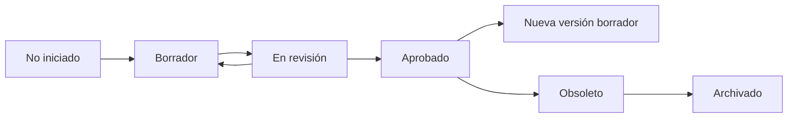
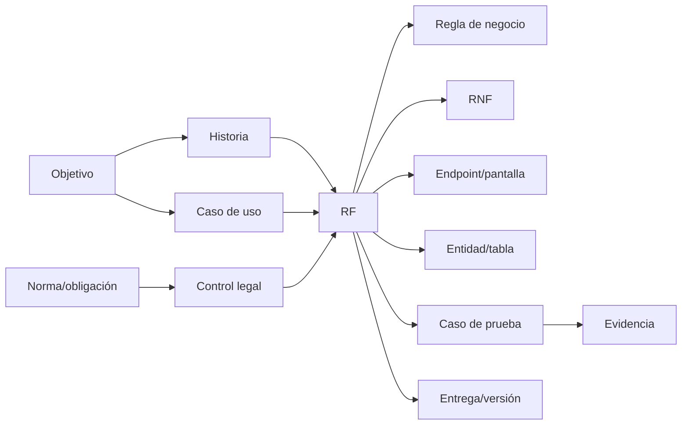

# Plan de generación documental

| Campo | Valor |
|---|---|
| Código | GDP-PLN-001 |
| Versión | 1.1 |
| Estado | Borrador para aprobación |
| Fecha | 2026-07-16 |
| Horizonte | Previo al inicio de programación |

## 1. Objetivo

Producir una línea base coherente, verificable y trazable de documentación funcional, técnica, arquitectónica, legal, de seguridad, calidad y operación para el Sistema de Gestión Documental, priorizando el MVP y evitando documentos aislados o genéricos.

## 2. Principios de ejecución

- Elaborar por dependencias: no diseñar endpoints o tablas antes de estabilizar alcance y requisitos.
- Mantener separación entre hechos del repositorio, decisiones aprobadas, propuestas, supuestos y pendientes.
- Aplicar ISO/IEC/IEEE 29148:2018 a requisitos; usar Gherkin para aceptación.
- Mantener trazabilidad bidireccional desde objetivo y norma hasta evidencia y entrega.
- Aplicar privacidad, seguridad, conservación e aislamiento multitenant desde el diseño.
- No convertir una copia normativa local en obligación sin verificar fuente oficial, vigencia y aplicabilidad.
- Usar Markdown/CSV/YAML UTF-8 y Mermaid; no crear entregables vacíos.
- Conservar las fuentes heredadas y registrar diferencias antes de modificar un documento existente.

## 3. Gobierno documental

| Rol | Responsabilidad | Titular pendiente |
|---|---|---|
| Patrocinador | Aprobar objetivos, presupuesto y alcance | `[PATROCINADOR]` |
| Product Owner | Priorizar producto y aceptar requisitos | `[PRODUCT_OWNER]` |
| Líder archivístico | Validar procesos, instrumentos y conservación | `[LIDER_ARCHIVISTICO]` |
| Arquitecto | Aprobar arquitectura y ADR | `[ARQUITECTO]` |
| Seguridad | Aprobar riesgos y controles | `[RESPONSABLE_SEGURIDAD]` |
| Protección de datos | Validar finalidades, bases jurídicas y titulares | `[RESPONSABLE_DATOS]` |
| Jurídico | Validar normas, contratos y políticas | `[ASESOR_JURIDICO]` |
| QA | Verificar calidad y trazabilidad | `[LIDER_QA]` |
| Operaciones | Validar despliegue, continuidad y soporte | `[LIDER_OPERACIONES]` |

## 4. Flujo de estado

Un documento aprobado solo cambia mediante solicitud registrada, análisis de impacto y nueva versión. Las matrices CSV deberán usar identificadores estables, nunca números de fila como identidad.

## 5. Plan por fases y entregas

### Fase 0 - Validación del diagnóstico

**Entradas:** fuentes heredadas y los tres documentos de esta ejecución.  
**Actividades:** revisar hallazgos, responder preguntas, nombrar responsables y aprobar convenciones.  
**Salida:** diagnóstico aceptado, RACI inicial y registro de decisiones abierto.  
**Puerta:** no iniciar catálogo masivo de RF sin segmento, modalidad de alta, MVP y responsables definidos.

### Fase 1 - Gobierno, alcance y producto

**Documentos:** acta, alcance, objetivos, interesados, RACI, glosario, control de cambios, riesgos, hoja de ruta, supuestos/restricciones y backlog inicial.  
**Decisiones:** público de lanzamiento; SaaS/on-premise; módulos MVP; criterios de éxito; exclusiones; volúmenes preliminares.  
**Validación:** Product Owner, patrocinador y líder archivístico.

### Fase 2 - Análisis de negocio y requisitos MVP

**Documentos:** ERS/SRS, procesos, actores, módulos, RF, RNF, reglas, historias, casos de uso, mensajes, validaciones, errores, criterios y trazabilidad.  
**Orden interno:** objetivos → procesos → actores → reglas → RF → RNF → aceptación/pruebas → trazabilidad.  
**Puerta:** cada RF debe tener actor, prioridad, módulo, criterios mínimos, prueba y vínculos; cada RNF debe tener métrica, objetivo, medición y evidencia.

La primera ola de RF cubrirá: organizaciones, dependencias, identidad, MFA, roles/permisos, series/subseries, tipos documentales, radicación de entrada/salida, documentos/versiones, expedientes, metadatos, búsqueda, auditoría, correo, consentimientos, solicitudes de titulares, reportes básicos y backup.

### Fase 3 - Arquitectura y datos

**Documentos:** C4, componentes, despliegue, integraciones, seguridad, multitenancy, ADR, amenazas, escalabilidad, disponibilidad, observabilidad, backup; modelos conceptual/lógico/físico y diccionario.  
**ADR aprobados:** arquitectura distribuida de macroservicios; TypeScript/Node.js 24 LTS; NestJS sobre Express; REST/OpenAPI 3.1; React/TypeScript/Vite; PostgreSQL con Kysely/pg y node-pg-migrate; Keycloak/OIDC/OAuth 2.0; EventBridge/SQS para SaaS. **ADR aún prioritarios:** detalle multitenant físico/RLS tras POC, almacenamiento/claves, búsqueda, auditoría, OCR, firma y adaptador de mensajería privado.  
**Puerta:** diagramas, entidades, APIs y requisitos deben usar los mismos nombres e identificadores.

### Fase 4 - Cumplimiento, seguridad y privacidad

**Documentos:** matriz legal, normas-requisitos, evidencias, datos personales, DPIA, controles OWASP, identidades, sesiones, secretos, cifrado, vulnerabilidades, incidentes, retención/eliminación, derechos de titulares y políticas legales.  
**Método legal:** norma/artículo → obligación → aplicabilidad → requisito/control → evidencia → responsable → riesgo.  
**Puerta:** aprobación jurídica especializada de obligaciones y textos legales; la supresión deberá reflejar excepciones archivísticas y legales.

### Fase 5 - Backend, frontend e integraciones

**Documentos:** módulos, convenciones, OpenAPI, endpoints, errores, validaciones, idempotencia, rate limiting, pantallas, rutas, componentes, accesibilidad y prototipos textuales.  
**Puerta:** cada endpoint/pantalla debe trazar a RF, permiso, entidad, error y caso de prueba; OpenAPI debe validar automáticamente.

### Fase 6 - Calidad

**Documentos:** estrategia/plan de pruebas, casos funcionales, seguridad, privacidad, rendimiento, accesibilidad, integración, recuperación, backup, multitenant, aceptación y matrices.  
**Puerta:** cobertura completa del MVP, sin RF huérfanos; pruebas antifuga y restore obligatorias antes de producción.

### Fase 7 - Despliegue, operación y manuales

**Documentos:** ambientes, CI/CD, configuración, AWS/privado, monitoreo, logs, alertas, backup/restore, escalamiento, runbooks, checklist, mantenimiento, actualizaciones y manuales base.  
**Puerta:** simulacro de recuperación, criterios operativos medibles y responsabilidades de soporte aprobadas.

## 6. Priorización documental inmediata

| Orden | Bloque | Razón | Dependencia |
|---:|---|---|---|
| 1 | Alcance, objetivos, interesados, RACI y glosario | Evita decisiones sin dueño y ambigüedad terminológica. | Diagnóstico validado |
| 2 | Supuestos, restricciones, riesgos y roadmap MVP | Controla alcance. | Decisión de mercado inicial |
| 3 | Actores/roles y procesos principales | Base de RF y seguridad. | Talleres de negocio/archivo |
| 4 | ERS/SRS y RF/RNF MVP | Línea base verificable. | Bloques 1-3 |
| 5 | Reglas, mensajes, casos e historias | Completa comportamiento y UX. | RF iniciales |
| 6 | Trazabilidad y backlog | Control de cobertura y entregas. | Identificadores estabilizados |
| 7 | Multitenancy, privacidad y amenazas | Riesgos críticos transversales. | Actores, datos y arquitectura preliminar |
| 8 | C4, ADR y modelo conceptual | Habilita diseño detallado. | Requisitos MVP |
| 9 | Matriz legal | Evita controles sin evidencia. | Requisitos y validación jurídica |
| 10 | API/datos/pruebas/operación | Diseño implementable y aceptable. | Arquitectura aprobada |

## 7. Plantillas y controles de calidad

### Requisito funcional

Debe incluir ficha técnica, flujo completo, validaciones, mensajes exactos, reglas, postcondiciones, cinco tipos de escenarios cuando apliquen y trazabilidad a objetivo, HU, CU, RN, RNF, entidad, tabla, endpoint, norma, control, prueba, evidencia y versión.

### Requisito no funcional

Debe incluir ID, nombre, descripción, métrica, valor objetivo, perfil/condiciones, forma de medición, evidencia, prioridad, riesgo y relación legal. “Rápido”, “seguro” o “disponible” sin umbral no son aceptables.

### Revisión automática prevista

- IDs únicos y referencias existentes.
- Todos los RF con actor, módulo, prioridad, aceptación y prueba.
- Todos los RNF con unidad, umbral, método y evidencia.
- Todos los controles legales con aplicabilidad y evidencia.
- Todas las tablas con PK, FK, `tenant_id` cuando corresponda y clasificación de datos.
- Todos los endpoints con autenticación, autorización, errores e idempotencia aplicable.
- Coincidencia de nombres entre ERS, C4, datos, OpenAPI y pruebas.

## 8. Trazabilidad mínima

La matriz deberá permitir recorrido inverso desde evidencia, tabla, endpoint o norma hasta el objetivo de negocio.

## 9. Gestión de fuentes y cambios

- No modificar fuentes heredadas. Si una futura corrección es necesaria, crear copia versionada o registrar diff y autorización.
- Para normas: registrar URL oficial, entidad emisora, fecha de consulta, versión, vigencia, aplicabilidad y huella local.
- Para decisiones: registrar contexto, alternativas, consecuencias y estado en ADR.
- Para supuestos: asignar responsable y fecha límite de validación; un supuesto invalidado genera análisis de impacto.
- Para campos empresariales desconocidos usar marcadores como `[NOMBRE_EMPRESA]`, nunca datos inventados.

## 10. Dependencias y preguntas de arranque

Antes de la Fase 1 se requieren responsables y decisión sobre primer segmento. Antes de la Fase 2 se requieren talleres con gestión documental, correspondencia, privacidad y usuarios. Antes de la Fase 3 se requieren volúmenes y RNF preliminares. Antes de la Fase 4 se requiere asesor jurídico designado. Antes de la Fase 7 se requieren modelo de soporte y objetivos RPO/RTO.

## 11. Definición de terminado documental

Un bloque está terminado cuando:

1. Sus documentos están completos, identificados y versionados.
2. No contiene contradicciones abiertas de severidad alta/crítica.
3. Las decisiones y supuestos están explícitos.
4. La trazabilidad automática no presenta huérfanos.
5. Los revisores competentes aprobaron el contenido.
6. Las fuentes y evidencias son reproducibles.
7. El índice maestro y control de cambios reflejan el estado real.

## 12. Próxima entrega recomendada

Tras aprobar este plan: `01_Acta_Inicio_Proyecto.md`, `02_Alcance_Proyecto.md`, `03_Objetivos_Proyecto.md`, `04_Interesados_Stakeholders.md`, `05_Matriz_RACI.csv`, `06_Glosario.md`, `07_Control_Cambios.md`, `08_Registro_Decisiones_Arquitectura.md`, `09_Riesgos_Proyecto.csv`, `10_Hoja_Ruta_Producto.md` y `01_Requisitos/15_Supuestos_Restricciones.md`.
