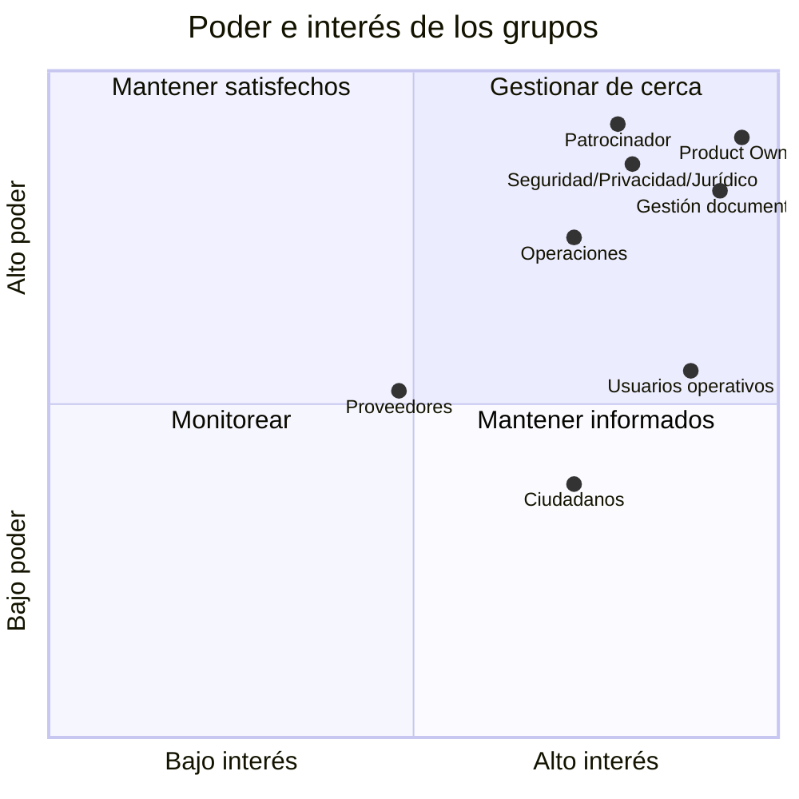

# Interesados del proyecto

| Campo | Valor |
|---|---|
| Código | GDP-STK-004 |
| Versión | 1.0 |
| Estado | Aprobado |
| Fecha | 2026-08-05 |
| Propietario | Antonio José Escrucería Uribe (Project Manager) |
| Revisores | Wilmar Betancur Valencia (Patrocinador), Álvaro Patiño Cruz (Product Owner) |
| Aprobador | Wilmar Betancur Valencia (Patrocinador) |

## 1. Propósito

Identificar grupos que deciden, usan, operan, regulan o son afectados por el SGD. Los nombres personales se mantienen como marcadores hasta la designación formal.

## 2. Registro de interesados

| ID | Interesado/grupo | Nombre/Contacto | Interés principal | Influencia | Impacto | Necesidad de información | Estrategia |
|---|---|---|---|---|---|---|---|
| STK-001 | Patrocinador | Wilmar Betancur Valencia (wbetancur679@gmail.com) | Valor, presupuesto, riesgo y cumplimiento | Alta | Alta | Estado, decisiones, riesgos, beneficios | Gestionar de cerca; aprobación por puertas |
| STK-002 | Product Owner | Álvaro Patiño Cruz (alvaropatcruz10@gmail.com) | Alcance, prioridad y aceptación | Alta | Alta | Backlog, métricas y feedback | Trabajo continuo; decisión de producto |
| STK-003 | Project Manager | Antonio José Escrucería Uribe (antoniojoseescruceria@gmail.com) | Plan, dependencias y entregas | Alta | Alta | Avance, bloqueos, capacidad | Seguimiento semanal |
| STK-004 | Líder de gestión documental | Álvaro Patiño Cruz (alvaropatcruz10@gmail.com) | Validez archivística y operación | Alta | Alta | Procesos, instrumentos, reglas | Talleres y aprobación funcional |
| STK-005 | Administrador de correspondencia/radicadores | Por definir (cliente Venus) | Registro y distribución eficiente | Media | Alta | Flujos, mensajes, excepciones | Prototipos y pruebas de aceptación |
| STK-006 | Técnicos de archivo | Por definir (cliente Venus) | Expedientes físicos/híbridos, préstamos y transferencias | Media | Alta | Operación detallada | Observación contextual y pruebas |
| STK-007 | Administradores de organización | Por definir (cliente Venus) | Configuración, usuarios y control | Alta | Alta | Permisos, configuración y reportes | Diseño participativo |
| STK-008 | Productores, revisores, aprobadores y firmantes | Por definir (cliente Venus) | Trámite documental | Media | Alta | Tareas, estados, responsabilidades | Pruebas por rol |
| STK-009 | Usuarios de consulta/auditores | Por definir (cliente Venus) | Acceso autorizado y evidencia | Media | Media | Búsqueda, exportación, logs | Revisión de permisos y reportes |
| STK-010 | Ciudadanos/titulares en fase posterior | Por definir (futuro) | Radicar, consultar, recibir respuesta y ejercer derechos | Media | Alta | Privacidad, accesibilidad, estado | Pruebas de usabilidad/accesibilidad |
| STK-011 | Responsable de protección de datos | Álvaro Patiño Cruz (alvaropatcruz10@gmail.com) | Finalidades, bases jurídicas y derechos | Alta | Alta | Inventario, consentimientos, incidentes | Aprobación de privacidad |
| STK-012 | Seguridad de la información | Antonio José Escrucería Uribe (antoniojoseescruceria@gmail.com) | Riesgo, IAM, cifrado, incidentes | Alta | Alta | Amenazas, controles, evidencias | Revisión desde diseño y gates |
| STK-013 | Jurídico/cumplimiento | Óscar Andrés Hoyos Hurtado (oscarandresoh@gmail.com) | Aplicabilidad normativa y contratos | Alta | Alta | Matriz legal, textos, proveedores | Validación especializada |
| STK-014 | Arquitectura/desarrollo | Antonio José Escrucería Uribe (antoniojoseescruceria@gmail.com) | Diseño implementable y mantenible | Alta | Alta | RF/RNF, ADR, datos y APIs | Refinamiento técnico |
| STK-015 | QA/accesibilidad | Neffer Anais Martínez (nefferanais05@hotmail.com) | Verificabilidad y calidad | Media | Alta | Criterios, ambientes, trazabilidad | Shift-left y gate de salida |
| STK-016 | Operaciones/soporte | David Ernesto Antequera Martínez (dantequera@gmail.com) | Disponibilidad, restore, monitoreo y soporte | Alta | Alta | SLO, runbooks, incidentes | Diseño operativo temprano |
| STK-017 | Finanzas/comercial | Por definir | Planes, facturación y costos | Media | Media | Roadmap, costos, suscripciones | Consulta por fase |
| STK-018 | Proveedores de nube/correo/OCR/firma/pago | Por definir | Prestación integrada | Media | Media | Contratos, API, SLA, datos | Due diligence y gestión contractual |
| STK-019 | Entidades de control/autoridades | Por definir | Cumplimiento y evidencia | Alta | Media | Reportes y trazabilidad | Atender según competencia; no asumir aprobación previa |
| STK-020 | Cliente piloto: Venus Ingeniería | José Sergio Arias Orizco (jsmx0622@gmail.com, 3116308160) | Validar usabilidad, flujos, integraciones | Alta | Alta | Prototipos, feedback, testing | Comité bi-mensual, pruebas participativas |

## 3. Mapa poder-interés

## 4. Segregación de intereses

- El Product Owner prioriza, pero no sustituye la aprobación jurídica, de seguridad o archivística.
- Desarrollo no aprueba unilateralmente controles que auditará o implementará.
- Soporte no obtiene acceso permanente a documentos de clientes.
- El administrador de organización no debe modificar evidencia de auditoría.
- La autoridad de eliminación/disposición debe estar separada de quien solicita o ejecuta cuando el riesgo lo requiera.

## 5. Plan de participación

| Evento | Participantes mínimos | Frecuencia/momento | Evidencia |
|---|---|---|---|
| Comité de producto | STK-001, 002, 003, 004 | Quincenal | Decisiones y backlog |
| Taller de requisitos | PO, usuarios, archivo, analista, QA | Por dominio | Minuta y requisitos |
| Revisión de arquitectura | Arquitectura, seguridad, datos, operaciones | Por ADR/hito | ADR y observaciones |
| Revisión legal/privacidad | Jurídico, datos, archivo, seguridad | Antes de aprobar controles/textos | Concepto o acta |
| Demo/aceptación | PO y usuarios representativos | Por incremento | Evidencia de aceptación |
| Revisión de riesgos | PM, dueños de riesgo | Mensual y ante cambios | Registro actualizado |

## 7. Pendientes inmediatos

- ✅ Responsables centrales nombrados y confirmados.
- ⏳ Confirmar disponibilidad para talleres (agosto-septiembre 2026).
- ⏳ Designar suplentes para roles críticos (PM, Arquitecto, PO, Seguridad).
- ⏳ Coordinar con Venus para confirmar representantes de usuarios (STK-005–STK-009).
- ⏳ Definir comité de producto (frecuencia, acta, escalaciones).

## 8. Historial

| Versión | Fecha | Cambio | Autor |
|---|---|---|---|
| 0.1 | 2026-07-16 | Registro inicial de grupos y participación. | Codex |
| 1.0 | 2026-08-05 | Responsables centrales nominados, cliente piloto Venus confirmado con contacto, STK expandido, participación aprobada. | Antonio José Escrucería Uribe |
