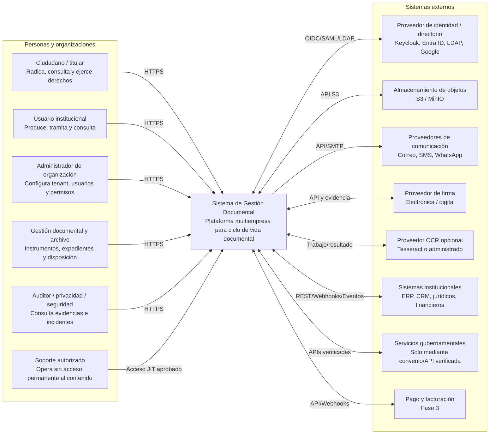
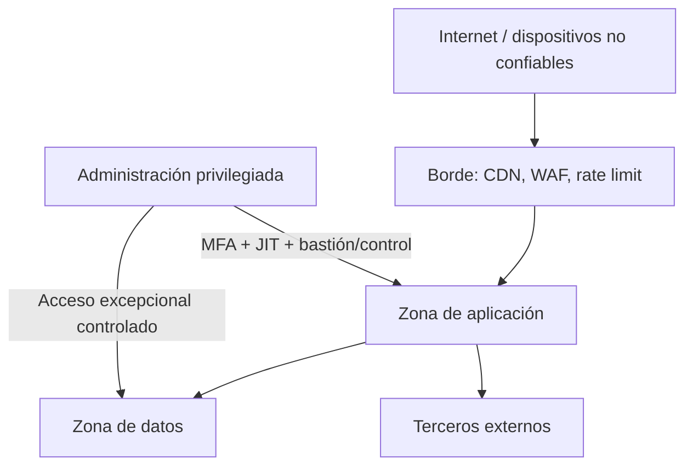

# Vista C4 - Contexto

| Campo | Valor |
|---|---|
| Código | GDP-ARQ-003 |
| Versión | 1.0 |
| Estado | Aprobado (Fase 3-A2) |
| Fecha | 2026-08-05 |
| Propietario | Antonio José Escrucería Uribe (Arquitecto) |
| Revisores | Álvaro Patiño Cruz (PO), David Ernesto Antequera Martínez (QA) |
| Nivel C4 | 1 - Contexto del sistema |
| Validado | Venus Ingeniería AS-IS (2026-08-05) |

## 1. Propósito

Mostrar el SGD como una caja única, sus personas y sistemas externos. La presencia de una integración en el diagrama no implica que forme parte del MVP; su fase se indica en el catálogo.

## 2. Alcance por actor

| Actor | Capacidades principales | Restricción crítica |
|---|---|---|
| Ciudadano/titular | Radicar, consultar caso, descargar respuesta, solicitud de privacidad | Solo sus casos; minimización y accesibilidad |
| Usuario institucional | Documentos, expedientes, tareas y búsqueda | Tenant, dependencia, clasificación y estado |
| Administrador | Estructura, membresías, roles y configuración | No altera auditoría ni accede por defecto a todo contenido |
| Gestión documental | Clasificación, TRD/TVD, transferencias y disposición | Segregación y actos aprobados |
| Auditor/privacidad/seguridad | Evidencias, incidentes y solicitudes | Solo lectura/acciones especializadas; propósito registrado |
| Soporte | Diagnóstico técnico | Acceso temporal, aprobado, mínimo y auditado |

## 3. Límites de confianza

- Todo tráfico externo se autentica o limita según canal público.
- El `tenant_id` no se acepta como autoridad solo por venir del cliente; se deriva de identidad/membresía y contexto autorizado.
- Terceros reciben el mínimo dato requerido y están sujetos a contrato, seguridad y retención.
- Enlaces a objetos son temporales, limitados a operación y objeto.

## 4. Dependencias MVP

MVP: identidad, almacenamiento de objetos, correo y antivirus. OCR puede integrarse en Fase 2. Firma, SMS, WhatsApp, pagos, facturación e integraciones gubernamentales no son dependencias del núcleo MVP salvo cambio aprobado.

## 5. Preguntas pendientes

- Proveedor de identidad operado y federaciones del piloto.
- Sistemas externos comprometidos contractualmente.
- Residencia de datos y modalidad privada.
- Canales ciudadanos y autenticación requerida por tipo de trámite.

