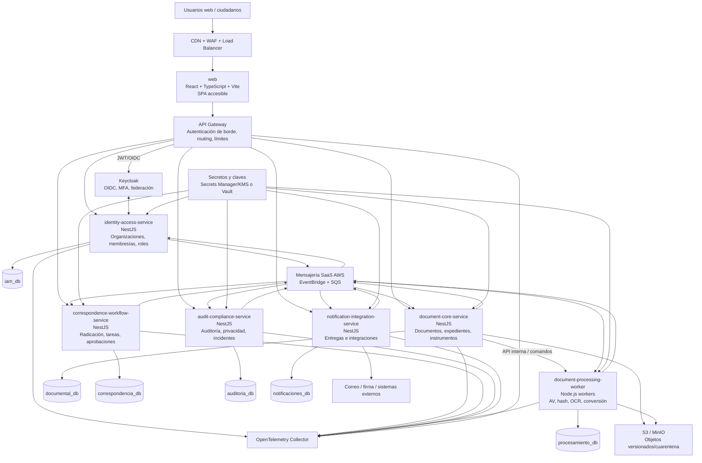

# Vista C4 - Contenedores

| Campo | Valor |
|---|---|
| Código | GDP-ARQ-004 |
| Versión | 1.0 |
| Estado | Aprobado (Fase 3-A2) |
| Fecha | 2026-08-05 |
| Propietario | Antonio José Escrucería Uribe (Arquitecto) |
| Revisores | Álvaro Patiño Cruz (PO), David Ernesto Antequera Martínez (QA) |
| Nivel C4 | 2 - Contenedores/desplegables |
| Validado | Venus Ingeniería AS-IS (2026-08-05) |

## 1. Decisión representada

Arquitectura distribuida con seis macroservicios iniciales más frontend, gateway, proveedor de identidad, almacenamiento, bus y observabilidad. Cada servicio posee sus datos; compartir una instancia PostgreSQL en ambientes iniciales no autoriza acceso cruzado a bases/esquemas.

## 2. Catálogo de contenedores

| ID | Contenedor | Responsabilidad | Escalamiento | Persistencia propia |
|---|---|---|---|---|
| CNT-001 | `web` | UI, navegación, render y BFF no dominante | RPS/CPU | Ninguna de negocio |
| CNT-002 | `api-gateway` | Routing, validación token, rate limit y correlación | RPS/latencia | Configuración técnica |
| CNT-003 | `identity-access-service` | Organizaciones, membresías, estructura y autorización general | RPS IAM | `iam_db` |
| CNT-004 | `document-core-service` | Núcleo documental e instrumentos | RPS/DB | `documental_db` |
| CNT-005 | `correspondence-workflow-service` | Radicación, consecutivos y procesos | Radicaciones/tareas | `correspondencia_db` |
| CNT-006 | `document-processing-worker` | AV, hash, OCR, conversión e integridad | Edad/profundidad cola | `procesamiento_db` + objeto |
| CNT-007 | `audit-compliance-service` | Auditoría, privacidad, incidentes y evidencias | Eventos/consultas | `auditoria_db` |
| CNT-008 | `notification-integration-service` | Notificaciones, reintentos, webhooks/adaptadores | Cola/entregas | `notificaciones_db` |
| CNT-009 | Keycloak | Autenticación, MFA y federación | Logins/sesiones | Base propia de Keycloak |
| CNT-010 | EventBridge + SQS | Eventos con fan-out y cola durable por consumidor; comandos directos | Mensajes/edad | Servicio administrado AWS |
| CNT-011 | S3/MinIO | Blobs, cuarentena y derivados | Throughput/capacidad | Objetos |
| CNT-012 | OTel Collector | Recepción/exportación de telemetría | Volumen telemetría | Backend externo |

## 3. Protocolos

| Relación | Protocolo | Regla |
|---|---|---|
| Navegador ↔ web/gateway | HTTPS | CSP, CSRF según sesión, límites y trazabilidad |
| Gateway ↔ servicios | HTTPS/REST JSON | OpenAPI, timeout, retry solo seguro, mTLS opcional |
| Servicios ↔ bus | Eventos versionados | At-least-once, idempotencia, DLQ y outbox |
| Servicios ↔ base propia | PostgreSQL/TLS mediante Kysely + pg | Credencial exclusiva, RLS tenant, pooling y migraciones node-pg-migrate |
| Servicios ↔ objetos | API S3/TLS | URL firmada, cifrado y mínimo privilegio |
| Servicio ↔ Keycloak | OIDC/OAuth 2.0 | Authorization Code + PKCE para web; client credentials controlado |
| Telemetría | OTLP | Sin contenido documental ni secretos |

## 4. Invariantes de operación

- Un servicio puede estar temporalmente indisponible sin corromper la verdad de otro.
- Ninguna cadena síncrona crítica tendrá más de dos saltos internos sin revisión arquitectónica.
- Los timeouts son obligatorios; no hay reintento automático de comandos no idempotentes.
- Cada escritura de negocio y su evento se confirman localmente mediante outbox.
- Las proyecciones se consideran eventualmente consistentes y muestran su estado.
- Todos los contenedores son stateless salvo bases, bus, objetos y Keycloak.

## 5. Despliegue de referencia

SaaS: ECS Fargate, RDS PostgreSQL, S3, EventBridge, SQS, Secrets Manager/KMS, WAF y CloudWatch/OTel. Privado: contenedores, PostgreSQL, MinIO, Keycloak, RabbitMQ de tres nodos con quorum queues y OTel/Prometheus/Grafana conforme a ADR-021. Kubernetes solo cuando alta disponibilidad/escala lo justifiquen.

## 6. Pendientes

- Implementación y POC del adaptador RabbitMQ privado aprobado por ADR-021; EventBridge/SQS está aprobado para SaaS.
- Gateway administrado frente a contenedor propio.
- Base/instancia por servicio en cada ambiente.
- Topología de Keycloak y alta disponibilidad.
- SLO/RPO/RTO definitivos.
