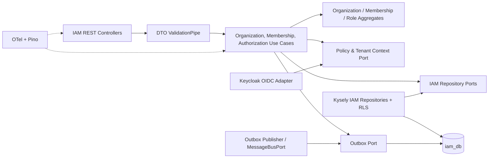
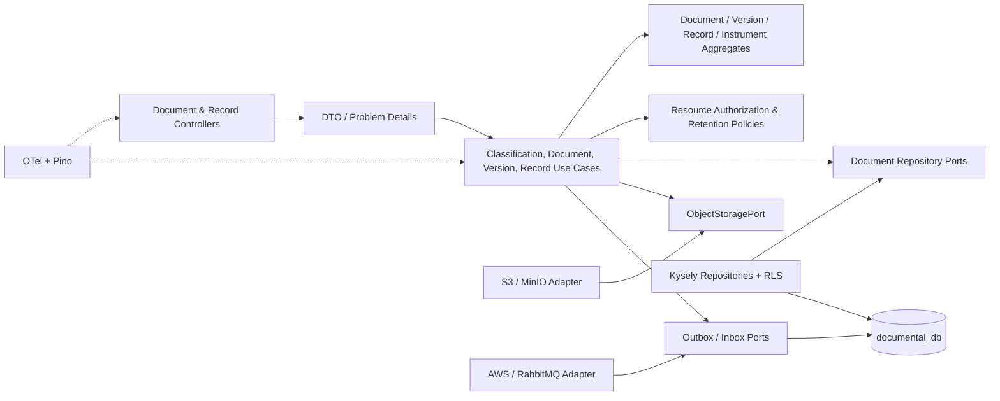
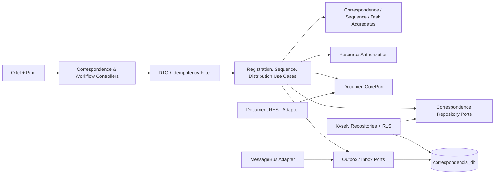
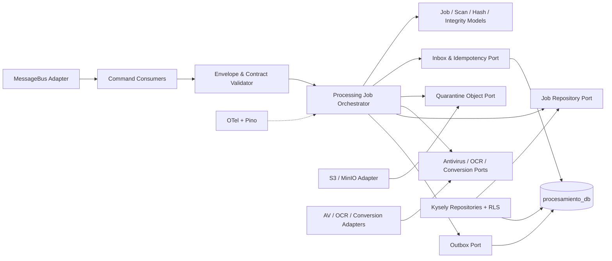
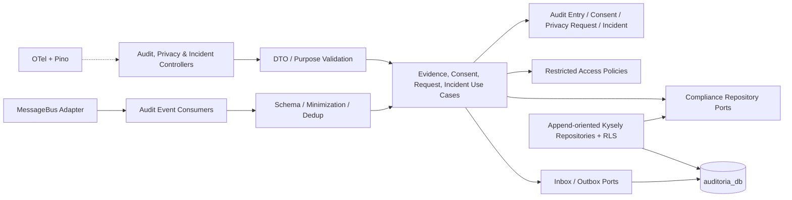
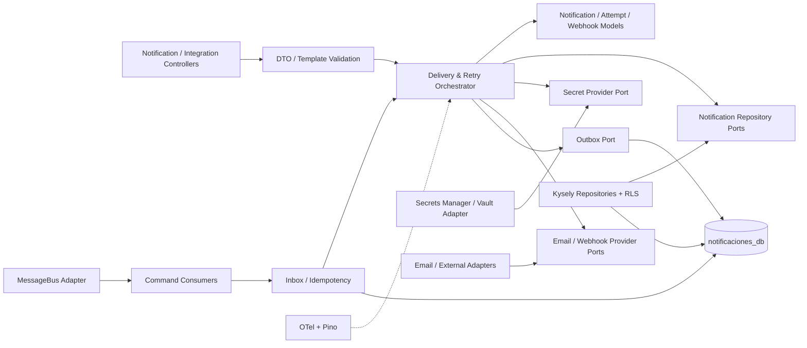

# Vista C4 nivel 3 — Componentes de macroservicios

| Campo | Valor |
|---|---|
| Código | GDP-ARQ-005 |
| Versión | 1.0 |
| Estado | Aprobado (Fase 3-A2) |
| Fecha | 2026-08-05 |
| Propietario | Antonio José Escrucería Uribe (Arquitecto) |
| Revisores | David Ernesto Antequera Martínez (QA), Neffer Anais Martínez (Operaciones), Óscar Hoyos (Seguridad) |
| Aprobador | Comité Arquitectura SGD |
| Validado | Venus Ingeniería AS-IS (2026-08-05) |

## Convenciones vinculantes

Cada macroservicio usa arquitectura por puertos y adaptadores: `interfaces` → `application` → `domain`; infraestructura implementa puertos y nunca filtra NestJS, Kysely, AWS o RabbitMQ al dominio. Los controladores validan forma; aplicación orquesta transacción/autorización; dominio protege invariantes; repositorios solo acceden a la persistencia propia. Outbox se escribe con el agregado; inbox con el efecto consumido. Telemetría envuelve límites sin registrar payload, token ni contenido.

## CNT-003 — identity-access-service

Contratos: API organización/estructura/membresía/contexto; consume identidad OIDC; produce EVT-001..005. Keycloak conserva credenciales; IAM conserva perfiles y membresías. Autoriza administración y entrega contexto, pero cada dominio vuelve a autorizar su recurso.

## CNT-004 — document-core-service

Contratos: RF-DOC-001..016; APIs de documentos/expedientes/carga; produce EVT-006..015 y comandos de proceso; consume resultados EVT-021/022/025. El blob está fuera de DB y solo pasa de cuarentena a disponible tras políticas aprobadas.

## CNT-005 — correspondence-workflow-service

Contratos: RF-COR-001..006; consecutivo local fuertemente consistente; referencia `document_id` externa sin FK. Produce EVT-016..020; consume cambios mínimos de estructura/clasificación mediante proyección autorizada.

## CNT-006 — document-processing-worker

No expone blob al usuario ni decide metadatos oficiales. Consume CMD-001..005/007 y produce EVT-021..025/031. Efecto, inbox y outbox resultante se confirman en transacción local; ACK ocurre después.

## CNT-007 — audit-compliance-service

Contratos: RF-AUD-001..006; produce EVT-026..028/032 y consume eventos catalogados. No permite actualización destructiva de auditoría; consentimientos y solicitudes no sustituyen decisión jurídica.

## CNT-008 — notification-integration-service

Contratos: RF-NIN-001/002; consume CMD-006 y produce EVT-029/030. Plantilla y canal se versionan; credenciales están fuera de tablas de negocio; reintentos acotados y DLQ poseen runbook.

## Reglas transversales verificables

1. Credencial DB y migraciones exclusivas por servicio; sin FK/join cruzado.
2. `tenant_id` se deriva de contexto validado, se aplica en transacción y RLS usa `SET LOCAL`.
3. Controllers no contienen negocio; dominio no importa framework/adaptador.
4. Todos los contratos externos se versionan; errores HTTP son RFC 9457.
5. Escritura + outbox y consumo + inbox + efecto son atómicos localmente.
6. Servicios exponen liveness, readiness y startup; restauran W3C Trace Context.
7. URLs prefirmadas son cortas, limitadas a objeto/operación y nunca viajan en eventos/logs.
8. Pruebas de arquitectura bloquean dependencias prohibidas y acceso de datos cruzado.

## Fuentes, supuestos, decisiones y pendientes

Fuentes: ADR-011..021, C4 nivel 2, mapa de dominios, propiedad de datos y catálogo de eventos. Supuesto: un repositorio lógico por agregado puede compartir transacción dentro del servicio. Decisiones: componentes y direcciones anteriores son vinculantes para el scaffold. Pendientes: motor de políticas, gateway definitivo, AV/OCR concreto, schema registry y detalle de APIs.

## Historial

| Versión | Fecha | Cambio | Autor |
|---|---|---|---|
| 0.1 | 2026-07-16 | C4 nivel 3 de los seis macroservicios MVP. | Codex |
