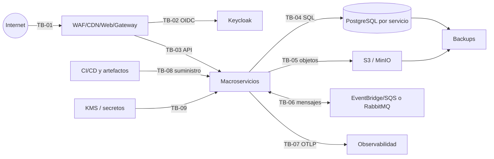

# Modelo de amenazas STRIDE

| Campo | Valor |
|---|---|
| Código | GDP-ARQ-015 |
| Versión | 1.0 |
| Estado | Aprobado (Fase 3-A3) |
| Fecha | 2026-08-05 |
| Propietario | Óscar Hoyos (Responsable Seguridad) |
| Revisores | Antonio José Escrucería Uribe (Arquitecto), Álvaro Patiño Cruz (Datos/PO), David Ernesto Antequera Martínez (QA), Neffer Anais Martínez (Operaciones) |
| Aprobador | Comité Seguridad SGD |
| Validado | Venus Ingeniería AS-IS (radicación, expedientes, búsqueda) |

## Alcance y método

STRIDE se aplica a SPA/gateway, Keycloak, seis macroservicios, PostgreSQL/RLS, S3/MinIO, bus AWS/RabbitMQ, telemetría, backups, secretos y CI/CD. Escala cualitativa inicial: impacto/probabilidad `Alta`, `Media`, `Baja`; no es riesgo residual aprobado. La matriz debe revisarse en POC-001/002 y ante cambios de frontera.

## Registro STRIDE y tratamientos

| ID | STRIDE | Activo/frontera y escenario | I/P | Controles requeridos | Evidencia / estado |
|---|---|---|---|---|---|
| THR-001 | S | Gateway: token falsificado, issuer/audience incorrectos | A/M | Validar firma, `iss`, `aud`, tiempo, algoritmo; rotación JWKS; fail closed | Prueba token manipulado; Pendiente G6 |
| THR-002 | S/E | Keycloak: robo de sesión, credential stuffing o MFA bypass | A/M | PKCE, MFA privilegiado, rate limit, sesión/recuperación segura, eventos IAM | POC autenticación/ZAP; Pendiente |
| THR-003 | E/I | Cambio de tenant altera claim/parámetro o reutiliza caché | A/A | Membresía activa servidor, contexto no falsificable, limpieza caché, autorización local | POC-001 + CP-MTN-001; Pendiente crítica |
| THR-004 | T/E | API usa mass assignment, inyección o DTO inesperado | A/M | allowlist DTO, ValidationPipe, SQL parametrizado, autorización por recurso | Unit/integración/ZAP; Diseñado |
| THR-005 | R | Usuario niega acción crítica por falta de correlación/tiempo | A/M | actor/tenant/recurso/resultado/correlation ID, reloj UTC y evidencia protegida | Casos auditoría; Diseñado |
| THR-006 | I | Problem Details o API revela existencia/datos de otro tenant | A/M | mensajes estables, minimización, política 403/404, filtros tenant antes de lookup | Pruebas negativas; Pendiente |
| THR-007 | D | Flooding/API costosa agota gateway o servicio | A/M | rate limit por sujeto/tenant/ruta, tamaño máximo, timeout, bulkhead | k6/alertas; Umbral OPV |
| THR-008 | E | Soporte JIT conserva privilegio o accede a contenido | A/M | aprobación, tiempo limitado, propósito, MFA, grabación/auditoría, revocación | Procedimiento JIT; Pendiente |
| THR-009 | T/I/E | PostgreSQL: consulta omite tenant o contexto del pool se fuga | A/A | filtros explícitos, RLS deny-default, `SET LOCAL` en transacción, usuario mínimo | POC-001/Testcontainers; Pendiente crítica |
| THR-010 | E/T | Credencial de servicio accede/migra DB ajena | A/M | usuario/base exclusivos, ACL/red, runtime sin DDL, CI de permisos | Prueba conexión cruzada; Pendiente |
| THR-011 | T | Migración destructiva o supply SQL altera evidencia | A/M | forward-only, firma/revisión, expand-contract, backup, usuario temporal | Pipeline migraciones; Pendiente |
| THR-012 | S/T/I | URL prefirmada robada, extendida o para key controlada | A/M | TTL corto, key opaca servidor, operación/tamaño/tipo limitados, TLS | POC-002; Pendiente crítica |
| THR-013 | T | Multipart mezcla partes, confirma objeto distinto o repite versión | A/M | sesión vinculada a tenant/documento/key/partes, checksum, idempotencia | POC-002/CA-DOC-006; Pendiente |
| THR-014 | I | Objeto malicioso se libera antes de AV/hash | A/M | bucket/prefijo cuarentena, sin lectura pública, estado cerrado, doble resultado | POC-002/CP-SEG-007; Pendiente crítica |
| THR-015 | T/R | WORM universal o bypass destruye/retiene indebidamente | A/B | WORM selectivo en bucket dedicado, separación funciones, legal hold/evidencia | Revisión configuración/jurídica; Pendiente |
| THR-016 | T/S | Evento/comando falsificado o envelope manipulado | A/M | IAM/TLS, productor autorizado, schema/version, tenant validado, tamaño máximo | Contract/security tests; Pendiente |
| THR-017 | R/T | Outbox pierde mensaje o confirm ambiguo duplica publicación | A/M | negocio+outbox atómico, confirms/resultado AWS, reconciliación, message ID | POC-002; Pendiente crítica |
| THR-018 | T | Redelivery o carrera repite efecto | A/A | inbox unique, efecto+inbox+outbox atómico, ACK después del commit | POC-002/CP-CON-006; Pendiente crítica |
| THR-019 | D | Poison message/retry infinito/DLQ saturada | M/M | retries acotados con jitter, DLQ por origen, alerta, retención y runbook | Prueba retry/DLQ; Pendiente |
| THR-020 | D/T | RabbitMQ pierde nodo/quorum o mensaje confirmado | A/M | 3 nodos, quorum queues, publisher confirms, discos/particiones alertados | POC pérdida nodo; Pendiente |
| THR-021 | I | Frontend guarda token/PII en Zustand o storage inseguro | A/M | keycloak-js, memoria/sesión controlada, CSP, no tokens en Zustand, limpieza tenant | Revisión/E2E; Diseñado |
| THR-022 | S/T | XSS/CSRF/dependencia frontend toma sesión | A/M | CSP, encoding, dependencias/SBOM, PKCE, CSRF según credencial, no HTML inseguro | ZAP/SCA/Playwright; Pendiente |
| THR-023 | I/R | Logs/traces contienen token, URL firmada, payload o dato sensible | A/M | allowlist/redacción Pino/OTel, acceso/retención, pruebas canario | Prueba sanitización; Pendiente crítica |
| THR-024 | T/E | Auditor modifica o elimina registros | A/M | append-only lógico, usuario mínimo, integridad/sellado, exportación controlada | Prueba permisos/fixity; Pendiente |
| THR-025 | I/T | Backup sin cifrar, accesible o restaurado en ambiente inseguro | A/M | cifrado/KMS, mínimo privilegio, aislamiento, inventario, expiración y prueba restore | CP-REC-001/002; Pendiente |
| THR-026 | I/E | Secreto en repo, imagen, variable/log o sin rotación | A/M | gestor de secretos, escaneo, identidad de carga, rotación/revocación | Secret scan/rotación; Pendiente |
| THR-027 | T/E | CI/CD o dependencia comprometida publica artefacto | A/M | branch protection, revisión, lockfile, firma, SBOM, digest, SAST/SCA, identidad corta | Attestation/pipeline; Pendiente G7 |
| THR-028 | D | Endpoint salud provoca dependencia en cascada o expone detalles | M/M | liveness local, readiness acotada, sin secretos, timeouts | Pruebas Terminus; Pendiente |
| THR-029 | I/T | Exportación mezcla tenants o queda disponible indefinidamente | A/M | consulta RLS, manifiesto tenant, cifrado, TTL, doble control y auditoría | CP-MTN-003; Pendiente crítica |
| THR-030 | R/I | Solicitud titular/consentimiento se procesa sin identidad/base | A/M | verificación proporcional, finalidad/versión, workflow y revisión jurídica | Casos privacidad; Pendiente legal |

## Prioridad de validación

Bloquean producción: THR-003, 009, 012, 014, 017, 018, 023, 025, 027 y 029. POC-001 valida contexto/RLS/cache; POC-002 valida objetos, outbox/inbox, broker, malware, trazas y DLQ. La aceptación de riesgo crítico requiere tratamiento demostrado; no basta firma administrativa.

## Privacidad y requisitos legales

El modelo identifica riesgos técnicos, no determina bases jurídicas, periodos, calidad probatoria ni aplicabilidad normativa. Consentimiento, derechos, conservación, WORM y exportaciones: **Requiere validación jurídica especializada**.

## Fuentes, supuestos, decisiones y pendientes

Fuentes: C4 niveles 1–3, ADR-011..021, RF/RNF, propiedad de datos y eventos. Supuesto: las modalidades AWS/privada implementan garantías equivalentes, no topología idéntica. Decisiones: controles marcados son requisitos arquitectónicos. Pendientes: propietario/fecha/estado residual por amenaza, DFD por flujo y resultados POC.

## Historial

| Versión | Fecha | Cambio | Autor |
|---|---|---|---|
| 0.1 | 2026-07-16 | STRIDE inicial con 30 amenazas y tratamientos. | Codex |
