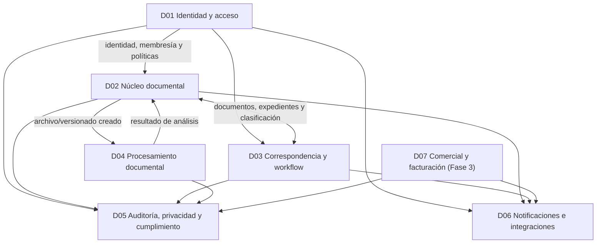

# Mapa de dominios y límites de servicio

| Campo | Valor |
|---|---|
| Código | GDP-ARQ-016 |
| Versión | 0.1 |
| Estado | Borrador para validación |
| Fecha | 2026-07-16 |
| Propietario | `[ARQUITECTO]` |

## 1. Objetivo

Definir bounded contexts y unidades desplegables iniciales para evitar tanto el monolito único como la fragmentación prematura. Un macroservicio puede contener varios módulos cohesivos, pero es propietario exclusivo de sus datos y contratos.

## 2. Dominios

## 3. D01 Identidad y acceso

**Responsabilidad:** organizaciones/tenants, sedes, dependencias, identidad, membresías, roles generales, permisos, delegaciones y contexto de tenant. Keycloak autentica mediante estándares; el servicio conserva conceptos propios de organización y membresía.

**Propietario de:** `organizations`, `tenants`, `headquarters`, `departments`, `users` (perfil de aplicación), `memberships`, `roles`, `permissions`, `user_roles`, `delegations`.

**No es propietario de:** permisos contextuales de un expediente/documento, contenido documental ni evidencias de auditoría.

## 4. D02 Núcleo documental

**Responsabilidad:** instrumentos de clasificación, documentos, versiones, archivos lógicos, metadatos, expedientes, retención, transferencias y disposición. Mantiene invariantes de integridad y ciclo de vida.

**Propietario de:** `series`, `subseries`, `document_types`, `retention_schedules`, `valuation_tables`, `documents`, `document_versions`, `document_metadata`, `document_files`, `records`, `files`, `transfers`, `dispositions`.

**No es propietario de:** número/flujo de radicación, identidad, almacenamiento físico del blob, ejecución OCR ni envío de notificaciones.

## 5. D03 Correspondencia y workflow

**Responsabilidad:** radicaciones de entrada/salida/internas, canales, consecutivos, distribución, tareas, vencimientos, revisión, aprobación y estado del trámite.

**Propietario de:** `correspondences`, `incoming_records`, `outgoing_records`, `internal_records`, `sequences`, `workflows`, `workflow_steps`, `tasks`, `approvals` y referencias a documentos/expedientes por ID externo.

**No es propietario de:** archivos/versiones, roles globales, logs de auditoría ni proveedor de correo.

## 6. D04 Procesamiento documental

**Responsabilidad:** carga en cuarentena, antivirus, hash, extracción/OCR, miniaturas, conversión, validación de formato y trabajos de integridad. Es principalmente asíncrono.

**Propietario de:** `processing_jobs`, `scan_results`, `ocr_results`, `conversion_results`, `integrity_checks`, claves/rutas de objeto temporales y estados técnicos.

**No es propietario de:** documento lógico, metadatos oficiales ni decisión de disposición.

## 7. D05 Auditoría, privacidad y cumplimiento

**Responsabilidad:** recepción resistente a alteración de eventos auditables, consentimientos, solicitudes de titulares, incidentes, evidencias y consultas autorizadas de cumplimiento.

**Propietario de:** `audit_logs`, `consent_logs`, `privacy_requests`, `incidents`, `compliance_evidence`.

**No es propietario de:** cuentas, documentos ni workflows. Consume copias mínimas necesarias; no crea una base paralela de contenido.

## 8. D06 Notificaciones e integraciones

**Responsabilidad:** plantillas/versiones, preferencias de canal, entregas, reintentos, webhooks, adaptadores a correo/SMS/WhatsApp/firma y sistemas externos.

**Propietario de:** `notification_templates`, `notifications`, `delivery_attempts`, `integrations`, `webhook_subscriptions`, `webhook_deliveries`.

**No es propietario de:** resultado de negocio que originó la notificación ni credenciales de usuario.

## 9. D07 Comercial y facturación

**Fase 3. Responsabilidad:** planes, suscripciones, consumo facturable, pagos y facturas mediante proveedores externos.

**Propietario de:** `plans`, `subscriptions`, `usage_records`, `payments`, `invoices`.

No se despliega en el MVP salvo decisión comercial que cambie el alcance.

## 10. Reglas entre dominios

1. Ningún servicio lee o escribe tablas de otro.
2. Las referencias externas se validan por contrato, evento o caché derivada autorizada.
3. REST se usa para respuesta inmediata; eventos para propagación y procesos desacoplados.
4. No existen transacciones distribuidas 2PC; se usan outbox, idempotencia, saga y reconciliación.
5. El contenido del archivo no viaja por el bus; se usa referencia temporal segura.
6. Todo mensaje tenant-scoped contiene `tenant_id` validado en origen y consumidor.
7. Cada servicio aplica autorización sobre sus recursos, aunque el gateway haya autenticado.
8. Auditoría recibe eventos, pero no sustituye logs técnicos ni observabilidad.
9. Los servicios mantienen compatibilidad de contratos durante la ventana acordada.
10. Una división futura requiere evidencia de carga, autonomía de equipo o ciclo de despliegue.

## 11. Riesgos de límites incorrectos

| Riesgo | Síntoma | Control |
|---|---|---|
| Monolito distribuido | Llamadas encadenadas para cada operación | Operación local + eventos; revisar chatty APIs |
| Base compartida de facto | Joins entre esquemas/credenciales comunes | Usuarios DB exclusivos y revisión automatizada |
| Duplicación de verdad | Dos servicios actualizan el mismo concepto | Propietario único y proyecciones derivadas |
| Evento como comando oculto | Consumidor obligatorio único con semántica imperativa | Nombrar hechos pasados; comandos explícitos cuando correspondan |
| Servicio demasiado pequeño | Despliegue sin autonomía real | Mantener módulos cohesivos en macroservicio |

## 12. Decisiones pendientes

- Ubicación definitiva de firma: workflow como orquestador, integración como adaptador y documental como custodio del resultado.
- Si privacidad permanece con auditoría o evoluciona a servicio propio por carga/equipo.
- Motor de workflow interno o componente especializado.
- Separación de organizaciones/estructura respecto de IAM al crecer.

