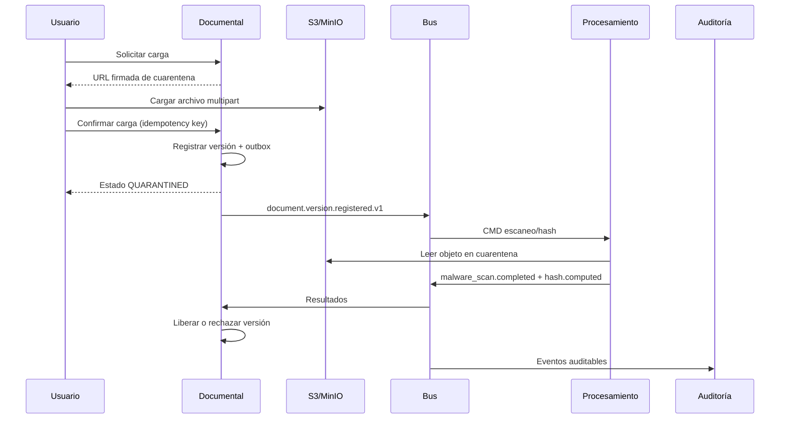
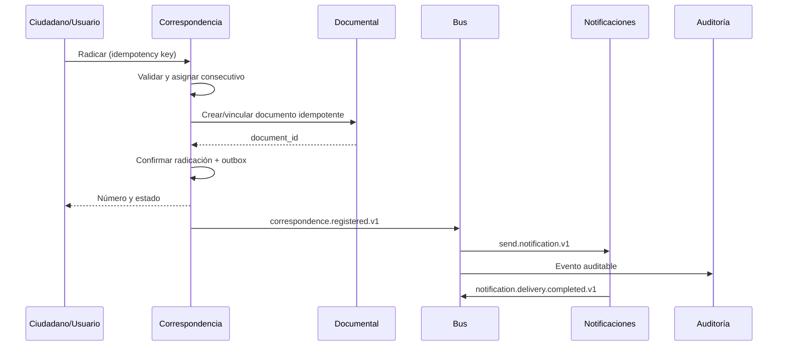

# Catálogo inicial de eventos y comunicaciones

| Campo | Valor |
|---|---|
| Código | GDP-ARQ-018 |
| Versión | 0.2 |
| Estado | Borrador; contratos conceptuales |
| Fecha | 2026-07-16 |
| Propietario | `[ARQUITECTO_INTEGRACION]` |

## 1. Principios

- Un evento expresa un hecho ocurrido, en pasado, y no se modifica.
- Entrega `at-least-once`; todo consumidor debe ser idempotente.
- Productor usa transactional outbox para no perder el evento de una escritura confirmada.
- Contratos usan JSON Schema/AsyncAPI en la fase de especificación.
- No se envían archivos ni contenido documental completo en el bus.
- PII se minimiza; los consumidores recuperan información autorizada por API cuando sea indispensable.
- Cambios incompatibles crean nueva versión de evento; campos nuevos opcionales son compatibles.
- Cada evento tiene dueño, clasificación, retención operativa y DLQ.
- En SaaS se usa EventBridge/SQS (ADR-014); en privado RabbitMQ (ADR-021), conservando el contrato lógico.
- El tamaño portable máximo inicial del mensaje completo es 256 KiB.

## 2. Sobre estándar

```json
{
  "specversion": "1.0",
  "id": "UUID",
  "type": "document.version.registered.v1",
  "source": "document-core-service",
  "subject": "document/{document_id}/version/{version_id}",
  "time": "RFC3339 UTC",
  "tenant_id": "UUID",
  "correlation_id": "UUID",
  "causation_id": "UUID|null",
  "actor": {
    "subject_id": "UUID|service",
    "actor_type": "user|service|system"
  },
  "classification": "internal|confidential|restricted",
  "datacontenttype": "application/json",
  "data": {}
}
```

Se adopta un sobre compatible conceptualmente con CloudEvents. `tenant_id` es obligatorio para hechos tenant-scoped y ausente/`null` solo para eventos explícitamente de plataforma.

## 3. Eventos de dominio iniciales

| ID | Tipo y versión | Productor | Consumidores iniciales | Datos mínimos | Condición |
|---|---|---|---|---|---|
| EVT-001 | `organization.created.v1` | IAM | Auditoría, Notificaciones | organization_id, tenant_id, status | Organización persistida |
| EVT-002 | `tenant.activated.v1` | IAM | Gateway/config, Auditoría | tenant_id, plan/profile | Tenant habilitado |
| EVT-003 | `organization.structure.changed.v1` | IAM | Documental, Correspondencia, Auditoría | department_id, operation, version | Alta/cambio/baja lógica |
| EVT-004 | `user.membership.changed.v1` | IAM | Auditoría, Notificaciones | subject_id, membership_id, status | Membresía cambia |
| EVT-005 | `authorization.assignment.changed.v1` | IAM | Auditoría, invalidación caché | subject_id, role/policy ref, operation | Asignación confirmada |
| EVT-006 | `classification.instrument.published.v1` | Documental | Correspondencia, Auditoría | instrument_id, version, effective_at | Instrumento publicado |
| EVT-007 | `retention.schedule.published.v1` | Documental | Correspondencia, Auditoría | schedule_id, version, effective_at | TRD/TVD aplicable publicada |
| EVT-008 | `document.created.v1` | Documental | Auditoría, Búsqueda/proyección | document_id, document_type_id, status | Documento lógico creado |
| EVT-009 | `document.version.registered.v1` | Documental | Procesamiento, Auditoría | document_id, version_id, object_ref temporal, declared_hash | Versión registrada/cuarentena |
| EVT-010 | `document.metadata.changed.v1` | Documental | Búsqueda/proyección, Auditoría | document_id, changed_fields, metadata_version | Cambio autorizado |
| EVT-011 | `record.created.v1` | Documental | Auditoría | record_id, classification refs, status | Expediente creado |
| EVT-012 | `record.document.incorporated.v1` | Documental | Auditoría, Correspondencia | record_id, document_id, order | Incorporación confirmada |
| EVT-013 | `record.closed.v1` | Documental | Auditoría, Correspondencia | record_id, closed_at, index_hash | Cierre confirmado |
| EVT-014 | `transfer.completed.v1` | Documental | Auditoría, Notificaciones | transfer_id, scope_ref, act_ref | Transferencia completada |
| EVT-015 | `disposition.authorized.v1` | Documental | Procesamiento, Auditoría | disposition_id, scope_ref, action, authorization_ref | Decisión aprobada |
| EVT-016 | `correspondence.number.assigned.v1` | Correspondencia | Auditoría | correspondence_id, number, timestamp, channel | Consecutivo confirmado |
| EVT-017 | `correspondence.registered.v1` | Correspondencia | Documental, Auditoría, Notificaciones | correspondence_id, number, direction, document_id | Radicación confirmada |
| EVT-018 | `workflow.task.assigned.v1` | Correspondencia | Notificaciones, Auditoría | task_id, assignee_ref, due_at, resource_ref | Tarea asignada |
| EVT-019 | `workflow.task.completed.v1` | Correspondencia | Notificaciones, Auditoría | task_id, outcome, completed_at | Tarea finalizada |
| EVT-020 | `approval.decided.v1` | Correspondencia | Documental, Auditoría, Notificaciones | approval_id, resource_ref, decision, reason_code | Decisión persistida |
| EVT-021 | `document.malware.scan.completed.v1` | Procesamiento | Documental, Auditoría | job_id, version_id, verdict, engine/version | Escaneo terminado |
| EVT-022 | `document.hash.computed.v1` | Procesamiento | Documental, Auditoría | version_id, algorithm, hash | Hash calculado |
| EVT-023 | `document.ocr.completed.v1` | Procesamiento | Documental, Búsqueda, Auditoría mínima | version_id, result_ref, language, confidence | OCR terminado |
| EVT-024 | `document.conversion.completed.v1` | Procesamiento | Documental | version_id, derivative_ref, format, validation | Derivado listo |
| EVT-025 | `document.integrity.checked.v1` | Procesamiento | Documental, Auditoría | version_id, expected_hash, result | Fixity verificada |
| EVT-026 | `privacy.consent.recorded.v1` | Auditoría/Privacidad | Ninguno por defecto | consent_id, subject_ref, consent_type, policy_version, status | Evidencia persistida |
| EVT-027 | `privacy.request.status.changed.v1` | Auditoría/Privacidad | Notificaciones, área asignada | request_id, type, status, due_at | Estado cambia |
| EVT-028 | `security.incident.reported.v1` | Auditoría/Seguridad | Seguridad/Privacidad según regla | incident_id, severity, category | Incidente registrado |
| EVT-029 | `notification.delivery.completed.v1` | Notificaciones | Originador, Auditoría mínima | notification_id, channel, outcome, provider_ref | Intento final/entrega |
| EVT-030 | `integration.delivery.completed.v1` | Integraciones | Originador, Auditoría | delivery_id, integration_id, outcome | Llamada/webhook finaliza |
| EVT-031 | `processing.job.completed.v1` | Procesamiento | Originador, Auditoría mínima | job_id, job_type, outcome, result_ref | Trabajo genérico termina |
| EVT-032 | `audit.event.recorded.v1` | Auditoría | Ninguno por defecto | audit_id, source_event_id, integrity_ref | Evento auditable persistido |
| EVT-033 | `subscription.status.changed.v1` | Comercial | IAM/entitlements, Auditoría | subscription_id, status, effective_at | Suscripción cambia; Fase 3 |
| EVT-034 | `payment.confirmed.v1` | Comercial | Facturación, Auditoría | payment_id, order_ref, amount/currency, provider_ref | Webhook verificado; Fase 3 |

## 4. Comandos asíncronos

Los comandos son solicitudes dirigidas y no deben disfrazarse como eventos.

| ID | Comando | Emisor | Receptor | Respuesta/evento | Idempotency key |
|---|---|---|---|---|---|
| CMD-001 | `scan.document.malware.v1` | Documental | Procesamiento | EVT-021 | version_id + scan_policy_version |
| CMD-002 | `compute.document.hash.v1` | Documental | Procesamiento | EVT-022 | version_id + algorithm |
| CMD-003 | `extract.document.text.v1` | Documental | Procesamiento | EVT-023 | version_id + ocr_profile_version |
| CMD-004 | `convert.document.format.v1` | Documental | Procesamiento | EVT-024 | version_id + target_profile |
| CMD-005 | `check.document.integrity.v1` | Documental | Procesamiento | EVT-025 | version_id + check_schedule_id |
| CMD-006 | `send.notification.v1` | Cualquier dominio autorizado | Notificaciones | EVT-029 | origin_event_id + template + recipient_ref |
| CMD-007 | `execute.disposition.v1` | Documental | Procesamiento | Resultado + evento de ejecución futuro | disposition_id + authorization_version |

## 5. Comunicaciones síncronas

| ID | Consumidor → Proveedor | Operación conceptual | Motivo síncrono | Timeout inicial | Reintento |
|---|---|---|---|---:|---|
| API-001 | Gateway → IAM | Resolver tenant/membresía autorizada | Seguridad de la solicitud | 2 s | Solo lectura, limitado |
| API-002 | Gateway → Documental | CRUD/consulta documental | Respuesta inmediata | 5 s | GET seguro |
| API-003 | Gateway → Correspondencia | Radicar/consultar trámite | Confirmación al usuario | 5 s | Solo con idempotency key |
| API-004 | Gateway → Auditoría | Consultar evidencias/privacidad | Interacción autorizada | 5 s | GET seguro |
| API-005 | Correspondencia → Documental | Reservar/crear vínculo documental | Invariante de radicación | 3 s | Idempotente |
| API-006 | Documental → IAM | Validar referencia organizacional excepcional | Integridad | 2 s | Lectura; preferir proyección |
| API-007 | Servicios → Notificaciones | Crear solicitud cuando requiere respuesta inmediata | Aceptación, no entrega | 2 s | Idempotency key |
| API-008 | Procesamiento → Objeto | Leer/escribir blob/derivado | Trabajo técnico | Según tamaño | Multipart/rango |

Se evitará que una petición de usuario dependa síncronamente de más de dos servicios internos. Si una operación necesita más, se rediseñará como proceso/saga con estado visible.

## 6. Flujo: versión documental segura



## 7. Flujo: radicación resiliente



## 8. Manejo de errores

- Reintentos exponenciales con jitter y máximo por tipo.
- DLQ conserva mensaje, causa, contador y referencia; acceso restringido.
- Reprocesamiento exige idempotencia y evidencia.
- Poison messages se aíslan, no bloquean partición/cola completa.
- Consumidor incompatible rechaza de forma observable; no ignora campos críticos.
- La reconciliación compara outbox, bus y estado de proyección.

## 9. Pendientes

- Mapeo físico definitivo de cada suscripción a EventBridge/SQS y RabbitMQ.
- Particionado/orden por tenant, documento o correspondencia.
- Retención del bus, DLQ y replay.
- Registro de schemas y AsyncAPI.
- Campos permitidos por clasificación y evento.
