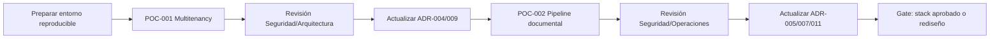

# Plan de pruebas de concepto arquitectónicas

| Campo | Valor |
|---|---|
| Código | GDP-ARQ-020 |
| Versión | 0.5 |
| Estado | Borrador; no autoriza desarrollo productivo |
| Fecha | 2026-07-16 |
| Propietario | `[ARQUITECTO]` |
| Ejecutores | Desarrollo, Seguridad, QA, Operaciones |

## 1. Objetivo

Reducir los dos riesgos técnicos principales antes de implementar el producto: aislamiento multitenant distribuido y procesamiento documental resiliente. El código de POC es desechable salvo decisión explícita; no debe evolucionar silenciosamente a producción.

## 2. Reglas comunes

- Repositorio o directorio claramente marcado `poc/`.
- Datos sintéticos, sin información personal real.
- Infraestructura reproducible mediante contenedores/IaC mínima.
- Versiones y dependencias fijadas con lockfile/SBOM.
- Evidencia: scripts, resultados, métricas, trazas y conclusión.
- Vitest, Supertest y Testcontainers se usan conforme a ADR-019; Playwright cubre los flujos de navegador aplicables.
- OpenTelemetry/OTLP, Pino y Collector instrumentan ambas POC conforme a ADR-020.
- No evaluar estética/UI; usar cliente mínimo.
- Cada criterio se marca aprobado, fallido o no ejecutado.

## 3. POC-001 - Multitenancy e identidad distribuida

### Hipótesis

NestJS + Kysely/pg + PostgreSQL puede propagar un contexto tenant confiable entre gateway y dos servicios, aplicar RLS y autorización local, y bloquear acceso cruzado incluso ante manipulación o error de consulta.

### Alcance

- Keycloak real con OIDC/OAuth 2.0; Authorization Code + PKCE y MFA forman parte de la prueba.
- Gateway mínimo.
- `identity-access-service` y `document-core-service` mínimos.
- Dos bases/esquemas y credenciales distintas; migraciones independientes con node-pg-migrate.
- Tenants A/B; usuario solo A; usuario con membresía A/B; soporte JIT simulado.
- OpenTelemetry para traza distribuida.
- Logs JSON correlacionados, métricas RED y endpoints de salud mínimos.

### Casos

| ID | Caso | Resultado esperado |
|---|---|---|
| P1-T01 | Usuario A consulta documento A | Permitido y auditado |
| P1-T02 | Usuario A usa ID conocido de documento B | 404/denegación sin revelar existencia |
| P1-T03 | Cliente cambia header `tenant_id` | Header no otorga autoridad; denegado |
| P1-T04 | Consulta omite filtro tenant en código | RLS impide filas ajenas |
| P1-T05 | Usuario A/B cambia contexto | Solo membresías válidas; evento/traza registra cambio |
| P1-T06 | Token expirado/revocado | Denegado según ventana definida |
| P1-T07 | Servicio IAM intenta leer DB documental | Credencial sin permiso/conexión |
| P1-T08 | Caché/proyección usa clave sin tenant | Prueba detecta defecto; diseño exige namespace tenant |
| P1-T09 | 500 concurrentes mezcla A/B | Cero fuga; SLO medido |
| P1-T10 | Acceso soporte JIT caduca | Acceso posterior denegado y evidencia completa |

### Métricas y salida

- Cero acceso cross-tenant.
- 100 % de consultas tenant-scoped protegidas por política/prueba.
- Trazas contienen correlation/tenant sin PII innecesaria.
- Evidencia de propagación W3C Trace Context entre gateway y servicios.
- p95 de autorización no excede presupuesto a definir (objetivo POC ≤ 100 ms adicional).
- Documento de decisión para Keycloak, claims, RLS, pooling y contexto transaccional.

### Criterio de fallo arquitectónico

Si RLS/contexto no puede aplicarse consistentemente con pooling/transacciones, ADR-004 se reabre y se evalúa esquema/base por tenant o capa de acceso alternativa.

## 4. POC-002 - Pipeline documental resiliente

### Hipótesis

El sistema puede cargar un archivo directamente a S3/MinIO, mantenerlo en cuarentena, confirmar una versión con outbox, procesar antivirus/hash de forma asíncrona y converger sin duplicación aunque existan reintentos y fallos.

### Alcance

- `document-core-service` mínimo.
- `document-processing-worker` mínimo.
- PostgreSQL separado, Amazon S3, MinIO, EventBridge/SQS en un entorno AWS de prueba reproducible y ClamAV.
- RabbitMQ de tres nodos con quorum queues en una variante privada reproducible conforme a ADR-021.
- URL firmada/multipart, outbox, inbox/deduplicación, DLQ y OTel.
- Adaptadores del mismo `ObjectStoragePort`, SSE-KMS, versionado canónico y bucket WORM selectivo conforme a ADR-016.
- Archivos sintéticos: limpio, EICAR de prueba, vacío, formato declarado falso, 500 MB generado sin datos reales.

### Casos

| ID | Caso | Resultado esperado |
|---|---|---|
| P2-T01 | Carga limpia | QUARANTINED → AVAILABLE tras AV/hash |
| P2-T02 | EICAR | REJECTED/QUARANTINED; nunca descargable por usuario |
| P2-T03 | Confirmación repetida | Una versión; misma respuesta idempotente |
| P2-T04 | Evento entregado tres veces | Un trabajo/efecto lógico; intentos observables |
| P2-T05 | Bus caído tras commit | Outbox conserva y publica al recuperar |
| P2-T06 | Worker cae durante escaneo | Mensaje reaparece; procesamiento converge |
| P2-T07 | ClamAV no disponible | Reintentos/DLQ; archivo sigue bloqueado |
| P2-T08 | Hash declarado no coincide | Rechazo/alerta según política; auditado |
| P2-T09 | Archivo de 500 MB | Streaming/multipart; API no carga todo en memoria |
| P2-T10 | URL firmada expirada/reutilizada | Fallo seguro según política |
| P2-T11 | Archivo tenant B con referencia manipulada | Servicio/objeto deniega cross-tenant |
| P2-T12 | Ráfaga de 10.000 trabajos | Cola absorbe; edad y escalamiento medidos |
| P2-T13 | Contrato esencial en S3 y MinIO | Multipart, HEAD, copia, descarga por rango y eliminación autorizada son equivalentes para el dominio |
| P2-T14 | Sobrescritura de clave existente | Diseño genera una clave nueva; la versión anterior permanece recuperable |
| P2-T15 | Borrado de objeto WORM retenido | Proveedor deniega; intento queda auditado |
| P2-T16 | Objeto o referencia huérfana | Reconciliación detecta y clasifica sin eliminar contenido canónico automáticamente |
| P2-T17 | Cifrado con clave del ambiente | Objeto usa la clave configurada y un rol no autorizado no puede descifrarlo |
| P2-T18 | Publicación RabbitMQ confirmada/no enrutable | Outbox solo confirma publisher ACK; retorno/nack mantiene pendiente y alerta |
| P2-T19 | Consumidor cae tras commit antes del ACK | Redelivery ocurre; inbox impide duplicar efecto |
| P2-T20 | Fallos transitorios y permanentes | Retry escalonado converge; agotado/inválido llega a la DLQ correcta |
| P2-T21 | Pérdida de un nodo RabbitMQ | Quorum conserva mensajes confirmados y reanuda consumo dentro del objetivo |

### Métricas y salida

- Cero archivo malicioso disponible.
- Cero versión/efecto duplicado.
- Cero evento confirmado perdido.
- Memoria API estable respecto al tamaño del archivo.
- Throughput, edad de cola, tiempo AV/hash y costo documentados.
- Validación de la decisión EventBridge/SQS: topología, costos, reintentos, DLQ, observabilidad y límites.
- Validación del adaptador RabbitMQ: confirms, mandatory, ACK manual, retries, DLQ, quorum, TLS y equivalencia contractual con AWS.
- Matriz comparativa S3/MinIO con diferencias verificadas de checksums, versionado, SSE-KMS, rangos y WORM.
- Evidencia de que la retención WORM solo se aplica a la clase dedicada y la clave KMS se cambia por configuración.
- Traza correlacionada desde confirmación de carga hasta veredicto del worker, incluidos reintentos y cola.
- Escenario k6 con checks y thresholds derivados del perfil de capacidad.

### Criterio de fallo arquitectónico

Si el outbox, idempotencia o streaming no cumplen, no se inicia radicación productiva. Se revisan tecnología de bus, contrato de carga y límites.

## 5. Secuencia de ejecución

## 6. Entregables por POC

1. README reproducible y diagrama ejecutado.
2. Código mínimo y manifiestos de infraestructura.
3. Catálogo de casos automatizados.
4. Resultados de seguridad/rendimiento.
5. Trazas, métricas y logs sanitizados.
6. Limitaciones y riesgos residuales.
7. Recomendación de aceptar, ajustar o rechazar el ADR.

## 7. Fuera de alcance

UI completa, lógica archivística extensa, firma, OCR de precisión, alta disponibilidad productiva, migración, pagos y optimización prematura. Las POC prueban arquitectura, no entregan funciones al usuario.

## 8. Puerta final

No se inicia el primer flujo vertical productivo hasta que POC-001 y POC-002 tengan evidencia revisada, riesgos críticos sin fallo abierto y ADR actualizados.
