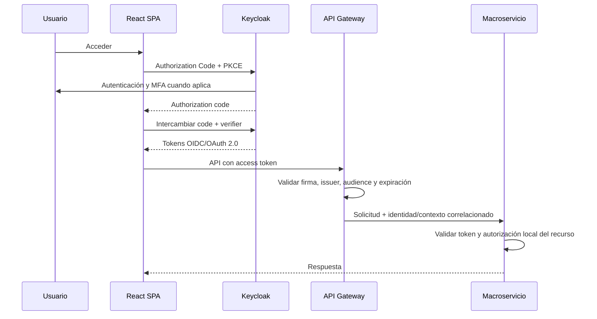

# ADR-013 - Autenticación con Keycloak, OIDC y OAuth 2.0

| Campo | Valor |
|---|---|
| ID | ADR-013 |
| Estado | Aceptada |
| Fecha | 2026-07-16 |
| Decisor | Propietario del proyecto |
| Relacionados | ADR-008, ADR-009, ADR-011, ADR-012 |

## Contexto

El producto requiere autenticación multitenant, MFA, recuperación, gestión de sesiones y futura federación con directorios institucionales. Implementar estas capacidades directamente en NestJS aumentaría el riesgo y la responsabilidad de seguridad. Se necesita una solución basada en estándares que funcione en AWS y pueda desplegarse en infraestructura privada.

## Decisión

Adoptar Keycloak como proveedor de identidad y autenticación:

- OpenID Connect para autenticación.
- OAuth 2.0 para autorización delegada de clientes y servicios.
- Authorization Code Flow con PKCE para la aplicación React.
- Client Credentials únicamente para comunicaciones servicio a servicio autorizadas.
- MFA administrado por Keycloak.
- Sesiones, recuperación, verificación de correo y credenciales administradas por Keycloak.
- Federación OIDC/SAML/LDAP futura según cliente.

El `identity-access-service` de NestJS no almacenará contraseñas ni implementará login propio. Será propietario de organizaciones, tenants, sedes, dependencias, perfiles de aplicación, membresías, roles de negocio, delegaciones y reglas de autorización propias.

## Distribución de responsabilidades

| Capacidad | Keycloak | NestJS IAM | Servicios de dominio |
|---|---:|---:|---:|
| Credenciales y hash de contraseña | Responsable | No | No |
| Login, logout y sesión SSO | Responsable | No | Valida token |
| MFA y recuperación | Responsable | Configura política de negocio/integración | No |
| Federación OIDC/SAML/LDAP | Responsable | Relaciona identidad externa | No |
| Organizaciones y tenants | Referencia mínima si se requiere | Responsable | Consume contexto autorizado |
| Membresías por organización | Claims mínimos/roles técnicos | Responsable | Valida según recurso |
| RBAC general | Roles técnicos opcionales | Responsable del modelo de negocio | Aplica permisos requeridos |
| ABAC documental | No | Aporta atributos organizacionales | Responsable sobre su recurso |
| Auditoría de login | Produce eventos/logs | Integra | Auditoría central conserva evidencia requerida |
| Datos documentales | No | No | Responsable del dominio |

## Flujo de autenticación web

La estrategia definitiva de almacenamiento de tokens en navegador se decidirá en el diseño de seguridad frontend. Se priorizará BFF/cookie `HttpOnly` cuando reduzca exposición frente a XSS; no se autoriza guardar refresh tokens en `localStorage`.

## Reglas de seguridad

1. HTTPS obligatorio.
2. Validar `iss`, `aud`, firma, `exp`, `nbf` y algoritmo permitido.
3. Rotación de claves y uso de JWKS con caché y renovación segura.
4. Access tokens de corta duración; valores exactos serán RNF.
5. MFA obligatorio para roles privilegiados y configurable por tenant según política soportada.
6. No incluir datos sensibles, permisos documentales extensos ni contenido en tokens.
7. El `tenant_id` activo debe corresponder a una membresía vigente; un claim enviado por el cliente no basta.
8. Cada macroservicio aplica autorización local y deniega por defecto.
9. Cuentas administrativas de Keycloak separadas de cuentas operativas.
10. Acceso a consola administrativa restringido, con MFA, red/control y auditoría.
11. Secretos de clientes confidenciales en Secrets Manager/Vault; la SPA será cliente público con PKCE.
12. Flujos implícito y Resource Owner Password Credentials no se usarán.

## Modelo multitenant

La decisión inicial es un realm de plataforma con organizaciones/membresías administradas por la aplicación, evitando crear un realm por cada tenant sin evidencia que lo justifique. Clientes con federación o aislamiento contractual especial podrán requerir configuración dedicada, sujeta a ADR posterior.

La cuenta global se vincula por `keycloak_subject_id` a un perfil de aplicación y a una o más membresías tenant. El cambio de tenant requiere membresía vigente y queda auditado.

## Consecuencias positivas

- Reduce código criptográfico y de sesiones desarrollado por el proyecto.
- Soporta MFA y federación mediante estándares.
- Funciona en AWS y despliegues privados.
- Centraliza políticas y ciclos de autenticación.
- Permite integrar directorios institucionales posteriormente.

## Consecuencias negativas

- Nuevo componente crítico que requiere operación, actualización, backup y alta disponibilidad.
- Personalización de UX y flujos debe respetar capacidades de Keycloak.
- Sincronización entre identidad Keycloak y membresías de aplicación exige idempotencia y reconciliación.
- Una mala configuración de realm, clientes o claims puede comprometer múltiples tenants.

## Alternativas rechazadas

- Autenticación desarrollada en NestJS: rechazada por carga de seguridad y mantenimiento.
- Amazon Cognito: no elegida por portabilidad privada y dependencia de AWS.
- Auth0/servicio SaaS externo: no elegido por dependencia, costos y requisitos potenciales de despliegue privado.

## Criterios de aceptación

1. POC-001 valida Authorization Code + PKCE, MFA y tokens.
2. Usuario de tenant A no puede activar ni consultar tenant B.
3. Usuario con membresías A/B cambia contexto de forma autorizada y auditada.
4. Token expirado, audiencia incorrecta, issuer incorrecto o firma inválida es rechazado.
5. Revocación/deshabilitación se refleja dentro de la ventana aprobada.
6. Servicios no consultan contraseñas ni datos de credencial.
7. Backup/restore y actualización de Keycloak son reproducibles.
8. Existe procedimiento de emergencia para claves y cuentas administrativas.

## Revisión

Después de POC-001, antes del piloto y ante un cliente que exija realm, directorio o proveedor de identidad dedicado.

