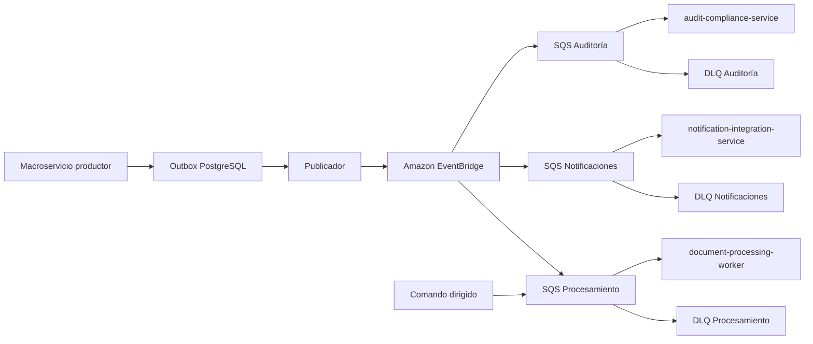

# ADR-014 - Mensajería SaaS con Amazon EventBridge y SQS

| Campo | Valor |
|---|---|
| ID | ADR-014 |
| Estado | Aceptada |
| Fecha | 2026-07-16 |
| Decisor | Propietario del proyecto |
| Alcance | Modalidad SaaS en AWS |
| Relacionados | ADR-007, ADR-010, ADR-011, ADR-012, ADR-021 |

## Contexto

La arquitectura distribuida necesita eventos de dominio para varios consumidores y comandos/trabajos durables dirigidos. Debe tolerar entrega repetida, consumidores temporalmente indisponibles y fallos entre persistencia local y publicación.

## Decisión

- Amazon EventBridge distribuirá eventos de dominio.
- Cada consumidor tendrá una cola Amazon SQS propia.
- Los comandos y trabajos dirigidos se enviarán directamente a SQS.
- SQS Standard será el valor predeterminado.
- SQS FIFO se usará únicamente cuando orden por grupo y deduplicación de transporte sean requisitos demostrados.
- Cada cola tendrá DLQ, política de reintentos, visibilidad, cifrado y alertas.
- Transactional Outbox e idempotencia del consumidor son obligatorios.
- Los contratos se especificarán mediante AsyncAPI y JSON Schema versionados.

## Topología

## Reglas vinculantes

1. Entrega asumida `at-least-once`; ningún consumidor confía en entrega única.
2. La clave de idempotencia y restricciones de persistencia impiden efectos duplicados.
3. Los mensajes incluyen `event_id`, tipo/versión, `tenant_id`, `correlation_id`, `causation_id`, fecha, productor, actor mínimo y `data` minimizada.
4. No se transmiten archivos ni contenido documental completo.
5. EventBridge transporta hechos; SQS directa transporta comandos dirigidos.
6. No se depende de orden global. FIFO requiere `MessageGroupId` basado en el agregado pertinente.
7. El borrado/reproceso de DLQ es una operación privilegiada y auditada.
8. La operación local confirmada se conserva aunque EventBridge/SQS esté temporalmente indisponible.
9. La edad de mensaje y profundidad de cola forman parte de los SLO operativos.
10. El SDK de AWS queda detrás de puertos/adaptadores; las reglas de dominio no dependen de clases AWS.

## Modalidad privada

ADR-014 aprueba la mensajería SaaS. ADR-021 aprueba RabbitMQ para instalaciones privadas mediante el mismo puerto lógico. La equivalencia se limita a contratos, entrega at-least-once, idempotencia, reintentos y DLQ; no se promete equivalencia de API o topología física.

## Consecuencias positivas

- Servicios administrados, durables y escalables.
- Fan-out desacoplado mediante EventBridge y backlog aislado por consumidor mediante SQS.
- Menor operación de brokers en SaaS.
- Escalamiento de workers por profundidad/edad de cola.

## Consecuencias negativas

- Dependencia operativa de AWS en modalidad SaaS.
- Consistencia eventual y mayor complejidad de diagnóstico.
- EventBridge no proporciona orden global.
- SQS puede entregar mensajes más de una vez; exige idempotencia real.

## Alternativas no seleccionadas para SaaS

- RabbitMQ: seleccionado mediante ADR-021 para instalaciones privadas; requiere operación de broker.
- BullMQ/Redis: no será bus de dominio ni cola durable principal.
- Kafka: complejidad y volumen no justificados para el MVP.
- NATS: no seleccionado por requerimientos operativos y experiencia por validar.

## Criterios de aceptación

1. POC-002 demuestra outbox, publicación, consumo repetido, DLQ y recuperación.
2. Caída del publicador no pierde eventos confirmados.
3. Entrega triple no duplica efectos.
4. Un consumidor detenido no bloquea otros consumidores.
5. Trazas permiten reconstruir productor, regla, cola y consumidor.
6. Cifrado, IAM mínimo y alarmas están configurados.

## Revisión

Después de POC-002, antes del piloto y si se introduce la modalidad privada.
