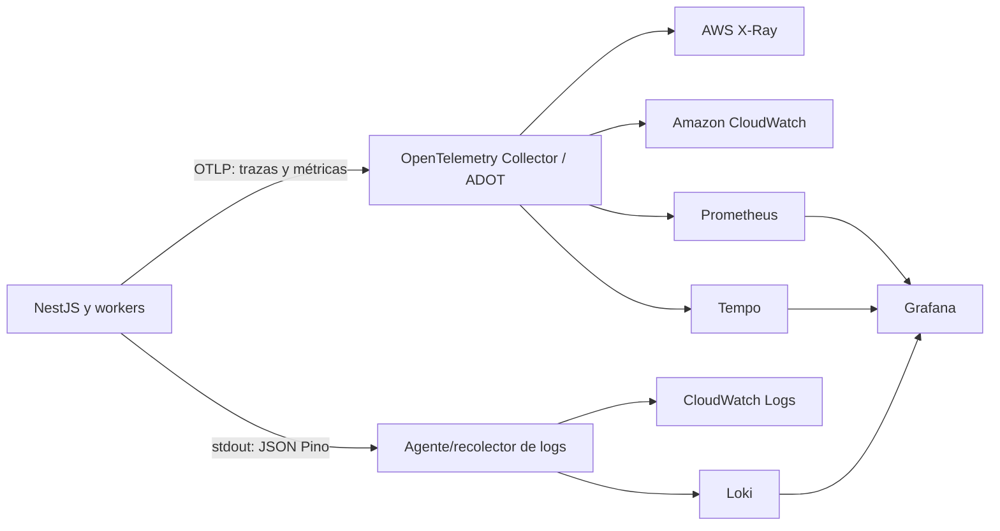

# ADR-020 - Observabilidad con OpenTelemetry y backends operativos

| Campo | Valor |
|---|---|
| ID | ADR-020 |
| Estado | Aceptada |
| Fecha | 2026-07-16 |
| Decisor | Propietario del proyecto |
| Relacionados | ADR-011, ADR-013, ADR-014, ADR-015, ADR-016, ADR-017, ADR-019, ADR-021 |

## Contexto

Los macroservicios, eventos, colas y trabajadores distribuyen una operación de negocio entre procesos y proveedores. Los logs aislados no permiten reconstruir una carga documental, medir SLO, detectar acumulación del outbox o diagnosticar una fuga de latencia. La solución también debe operar como SaaS en AWS y en instalaciones privadas sin instrumentar el código dos veces.

La telemetría puede contener identificadores y datos sensibles, generar costos por volumen y degradar el servicio si se usa sin límites. Se requiere un estándar portable, correlación consistente, control de cardinalidad, sanitización y alertas vinculadas al impacto.

## Decisión tecnológica

| Responsabilidad | Tecnología aprobada |
|---|---|
| Instrumentación | OpenTelemetry |
| Protocolo de exportación | OTLP |
| Recolección/procesamiento | OpenTelemetry Collector |
| Trazas y métricas Node.js | OpenTelemetry SDK e instrumentaciones aprobadas |
| Logs estructurados | Pino + `nestjs-pino` |
| Contexto distribuido | W3C Trace Context |
| Salud NestJS | `@nestjs/terminus` |
| Distribución AWS | AWS Distro for OpenTelemetry (ADOT) |
| Backend SaaS | Amazon CloudWatch + AWS X-Ray |
| Métricas privadas | Prometheus |
| Visualización privada | Grafana |
| Logs privados | Loki |
| Trazas privadas | Tempo |

La aplicación exportará telemetría mediante estándares y no dependerá en el dominio de APIs propietarias de CloudWatch, X-Ray, Prometheus, Loki o Tempo.

## Flujo de telemetría



La topología concreta se define por modalidad de despliegue. El Collector aplica batching, límites, muestreo, enriquecimiento controlado y exportación; no se utiliza como lugar para reconstruir lógica de negocio.

## Convenciones de recursos

Toda señal incluirá atributos de recurso estables:

- `service.name`;
- `service.namespace`;
- `service.version`;
- `deployment.environment.name`;
- región/instancia cuando sea operacionalmente necesario;
- versión del esquema de telemetría.

No se usarán nombres de pod, host efímero o IDs dinámicos como dimensiones principales de tableros/SLO.

## Logs estructurados

Pino emitirá JSON a stdout. `nestjs-pino` integrará contexto HTTP sin registrar cuerpos por defecto.

Campos base:

```json
{
  "timestamp": "2026-07-16T18:00:00.000Z",
  "level": "info",
  "service": "document-core-service",
  "environment": "production",
  "eventCode": "DOCUMENT_VERSION_REGISTERED",
  "message": "Document version registered",
  "traceId": "...",
  "spanId": "...",
  "correlationId": "..."
}
```

Reglas:

1. Mensajes humanos no sustituyen `eventCode` estable.
2. Excepciones se serializan de forma sanitizada; stack trace solo en destinos internos autorizados.
3. Se redactan headers de autorización, cookies y secretos.
4. No se registran tokens, contraseñas, URLs prefirmadas, contenido documental, claves KMS, cuerpos completos, SQL con valores ni datos personales innecesarios.
5. `tenantId`, `actorId`, `documentId`, `eventId`, `messageId` y `jobId` solo se incluyen donde sean necesarios, con acceso y retención restringidos.
6. El nivel se configura por ambiente; producción no habilita debug global de forma permanente.
7. La pérdida temporal del backend de logs no detiene una operación de negocio ni bloquea indefinidamente stdout.

## Trazas distribuidas

W3C Trace Context se propagará en REST y se transportará como metadato en eventos, comandos y trabajos. Se crearán spans para:

- gateway y solicitudes NestJS;
- llamadas REST salientes;
- producción outbox y publicación;
- EventBridge/SQS o RabbitMQ y consumo;
- transacciones/consultas PostgreSQL relevantes;
- S3/MinIO;
- Keycloak y demás integraciones;
- antivirus, hash, OCR y derivados.

Los nombres de span y rutas serán normalizados; nunca incluirán IDs, nombre de archivo, términos de búsqueda o PII. No se adjuntarán payloads de documentos/eventos.

`correlationId` es un identificador funcional/operativo que puede abarcar reintentos; `traceId` identifica una ejecución distribuida concreta. No se tratarán como equivalentes.

## Métricas

Los servicios aplicarán RED:

- tasa de solicitudes/trabajos;
- errores por tipo controlado;
- duración y percentiles.

La infraestructura aplicará USE:

- utilización;
- saturación;
- errores.

Métricas iniciales:

- latencia y tasa HTTP por ruta normalizada;
- errores 4xx/5xx categorizados;
- conexiones, espera y errores PostgreSQL;
- retraso y tamaño del outbox;
- profundidad, edad y DLQ de colas;
- duración y resultado del procesamiento documental;
- objetos en cuarentena y reconciliación;
- fallos de antivirus, KMS y almacenamiento;
- cargas iniciadas, completadas y abandonadas;
- operaciones de disposición y denegaciones por retención;
- disponibilidad y latencia de dependencias críticas.

Queda prohibido usar `tenantId`, `userId`, `documentId`, `traceId`, `correlationId`, URL completa, mensaje de excepción u otro valor no acotado como etiqueta de métrica.

## Muestreo y volumen

- POC/desarrollo puede usar 100 % de trazas durante ventanas controladas.
- Producción usa muestreo parent-based configurable y políticas de tail sampling en Collector cuando corresponda.
- Errores, alta latencia y operaciones críticas pueden conservarse con mayor prioridad sin capturar payloads.
- El porcentaje no se codifica en lógica de dominio.
- Métricas necesarias para SLO no se muestrean como trazas.
- Límites, batching y colas del Collector evitan consumo ilimitado.
- Se monitorea el propio pipeline de telemetría, incluidos descartes y fallos de exportación.

## Salud

`@nestjs/terminus` implementará endpoints separados:

| Endpoint | Finalidad | Regla |
|---|---|---|
| `/health/live` | Proceso vivo | No depende de todos los externos |
| `/health/ready` | Puede aceptar tráfico/trabajo | Verifica dependencias esenciales con timeout |
| `/health/startup` | Inicialización finalizada | Configuración y preparación requeridas completas |

Los endpoints no revelan hosts, versiones detalladas, credenciales ni topología. Una dependencia opcional no derriba readiness salvo que el servicio no pueda cumplir su responsabilidad principal.

## SLO, tableros y alertas

Cada servicio tendrá propietario, SLI/SLO y tablero mínimo. Las alertas se basarán en síntomas e impacto:

- burn rate del presupuesto de error;
- indisponibilidad y 5xx sostenidos;
- latencia p95/p99 fuera del objetivo;
- cola, DLQ u outbox acumulándose;
- procesamiento detenido o envejecido;
- saturación PostgreSQL;
- fallos de Keycloak, KMS o almacenamiento;
- reconciliación con referencias/objetos inconsistentes;
- ausencia inesperada de telemetría.

Toda alerta accionable incluye severidad, servicio, propietario, enlace a tablero y runbook. No se alerta por cada excepción individual ni por métricas sin acción definida.

## Modalidad SaaS AWS

- ADOT/OpenTelemetry Collector recibe OTLP.
- X-Ray conserva y consulta trazas.
- CloudWatch recibe métricas, logs y alarmas según diseño operativo.
- IAM aplica mínimo privilegio a publicación y consulta.
- Cifrado, retención y acceso se configuran por ambiente.
- Los costos de ingestión, índices y retención se revisan antes del piloto.

El uso futuro de Amazon Managed Service for Prometheus, Managed Grafana u OpenSearch requiere decisión complementaria; no es necesario para aceptar esta base.

## Modalidad privada

- Prometheus recopila/consulta métricas.
- Tempo conserva trazas.
- Loki conserva logs.
- Grafana correlaciona y visualiza las señales.
- El Collector mantiene OTLP como entrada y desacopla las aplicaciones.
- RabbitMQ expone métricas a Prometheus; Grafana muestra colas, ready/unacked, reintentos, DLQ, consumidores, disco y quorum conforme a ADR-021.

Alta disponibilidad, almacenamiento, backup, retención y dimensionamiento del stack privado se definirán en la arquitectura de despliegue; no se presupone que un contenedor único sea productivo.

## Frontend

No se adopta instrumentación OpenTelemetry de navegador en este ADR. Inicialmente el frontend propagará `traceparent` cuando la política/CORS lo permita y capturará de forma controlada:

- versión desplegada;
- errores no controlados y de carga de ruta;
- Web Vitals;
- fallos API por código/categoría;
- `correlationId` devuelto por el backend.

La herramienta de error tracking frontend permanece pendiente de evaluación de privacidad, residencia, sanitización, costo y consentimiento. No se capturan valores de formularios, tokens, nombres documentales ni contenido.

## Seguridad, privacidad y retención

1. La telemetría se clasifica como dato operativo potencialmente sensible.
2. Acceso mediante roles separados y mínimo privilegio.
3. Cifrado en tránsito y reposo.
4. Retención diferenciada por señal y ambiente; no indefinida por defecto.
5. Búsquedas y exportaciones de logs quedan auditadas cuando el backend lo permita.
6. Redacción y pruebas automatizadas evitan secretos/PII.
7. La telemetría no sustituye el registro de auditoría inmutable del dominio.
8. No se reutiliza telemetría para finalidades incompatibles sin análisis y autorización.

## Alternativas no seleccionadas

- SDK propietario directo en cada servicio: aumenta acoplamiento y duplica instrumentación.
- Solo logs: insuficiente para latencia y causalidad distribuida.
- ELK/OpenSearch como estándar inicial: válido, pero no necesario junto al backend SaaS/privado aprobado.
- OpenTelemetry Logs como única ruta inicial: se prioriza Pino JSON por madurez operativa en Node.js.
- `console.log`: carece de estructura, redacción y correlación uniforme.
- IDs de tenant/documento como labels: cardinalidad y costo no acotados.
- Sentry u otro tracking frontend: decisión pendiente, no rechazada.

## Criterios de aceptación

1. Una solicitud REST produce log, métrica y traza correlacionables.
2. El contexto continúa por outbox, EventBridge/SQS o RabbitMQ y consumidor sin confundir reintentos.
3. POC-001 permite seguir una operación multitenant sin exponer PII.
4. POC-002 muestra carga, almacenamiento, cola, worker y resultado en una traza distribuida.
5. Ninguna métrica usa dimensiones de cardinalidad no acotada.
6. Pruebas automatizadas verifican redacción de tokens, cookies, URLs firmadas y cuerpos.
7. Liveness y readiness reaccionan correctamente ante fallos de dependencias.
8. La misma aplicación exporta por OTLP hacia un backend AWS y uno privado sin cambiar dominio.
9. Un tablero RED y una alerta con runbook funcionan para un flujo vertical.
10. La caída del Collector/exportador no rompe la transacción de negocio.

## Revisión

Después de POC-001/002, tras el primer flujo vertical, antes del piloto, al definir SLO/RPO/RTO y ante cambios de backend, volumen, regulación o madurez de OpenTelemetry Logs/browser.
