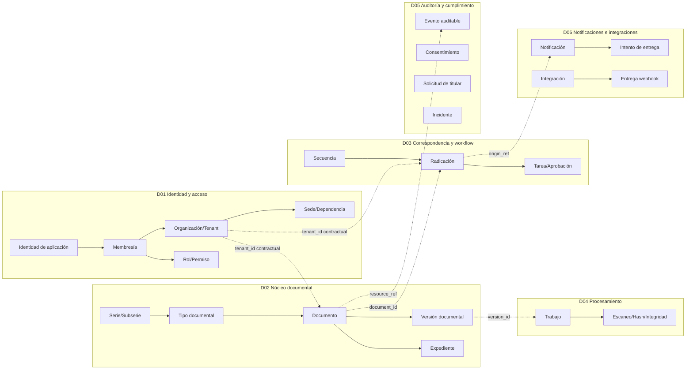

# Modelo conceptual de información

| Campo | Valor |
|---|---|
| Código | GDP-DAT-001 |
| Versión | 0.1 |
| Estado | Borrador para validación |
| Fecha | 2026-07-16 |
| Propietario | `[ARQUITECTO_DATOS]` |
| Revisores | `[ARQUITECTO]`, `[LIDER_ARCHIVISTICO]`, `[RESPONSABLE_DATOS]`, `[RESPONSABLE_SEGURIDAD]` |
| Aprobador | `[COMITE_ARQUITECTURA]` |

## Propósito

Representar conceptos y relaciones del MVP sin simular una base única. Cada bloque corresponde a una fuente de verdad independiente; las líneas entre bloques son referencias contractuales por ID, API o evento, nunca claves foráneas entre servicios.

## Conceptos y propiedad

| Contexto | Conceptos fuente de verdad | Referencias externas permitidas |
|---|---|---|
| IAM | organización, tenant, sede, dependencia, usuario de aplicación, membresía, rol, permiso, delegación | `keycloak_subject_id`; ninguna credencial |
| Documental | instrumentos, documento, metadatos, versión, referencia de objeto, expediente, incorporación, transferencia y disposición | `tenant_id`, `actor_subject_id`, dependencias por ID |
| Correspondencia | radicación, secuencia, distribución, workflow, tarea y aprobación | `document_id`, `record_id`, responsables/dependencias por ID |
| Procesamiento | trabajo, resultado AV/OCR/conversión/hash/integridad | `document_version_id`, referencias opacas de objeto |
| Auditoría | evidencia, consentimiento, solicitud de titular, incidente | referencias polimórficas mínimas a sujeto/recurso/evento |
| Notificaciones | plantilla, notificación, intento, integración, webhook | `origin_event_id`, destinatario minimizado o referencia autorizada |

## Clasificación y ciclo de vida

- Todo dato tenant-scoped incluye `tenant_id`; datos de plataforma deben marcarse explícitamente como globales.
- Datos personales: perfiles, membresías, remitentes/destinatarios, consentimientos, solicitudes, actores, destinatarios y potencialmente cualquier contenido/metadato documental.
- Datos sensibles: no se presuponen como campos estructurados, pero pueden existir en documentos, OCR, incidentes y evidencia; se aplica diseño conservador.
- El propietario define retención; valores concretos permanecen `Pendiente de instrumento/base jurídica`. **Requiere validación jurídica especializada**.
- Proyecciones son derivadas, versionadas y reconstruibles; nunca adquieren propiedad de escritura sobre el concepto origen.

## Invariantes conceptuales

1. Una organización delimita un tenant; cualquier excepción futura requiere ADR.
2. Una identidad puede tener varias membresías, pero una membresía pertenece a un tenant.
3. Una versión pertenece a un único documento y no se sobrescribe.
4. Un blob no es un documento: se conserva referencia, hash, estado y procedencia.
5. Un consecutivo pertenece a tenant, tipo y vigencia; su unicidad es local a Correspondencia.
6. Auditoría registra hechos mínimos y no replica contenido completo.
7. Eliminación física exige disposición autorizada, ausencia de bloqueo y evidencia.

## Fuentes, supuestos, decisiones y pendientes

Fuentes: mapa de dominios, matriz de propiedad, RF/RN, ADR-011/015/016 y G3. Supuesto: organización y tenant son 1:1 en MVP. Decisiones: fuente única por concepto y referencias externas sin FK. Pendientes: instrumentos del cliente, campos de metadatos, retención, clasificación y residencia.

## Historial

| Versión | Fecha | Cambio | Autor |
|---|---|---|---|
| 0.1 | 2026-07-16 | Modelo conceptual distribuido inicial. | Codex |
