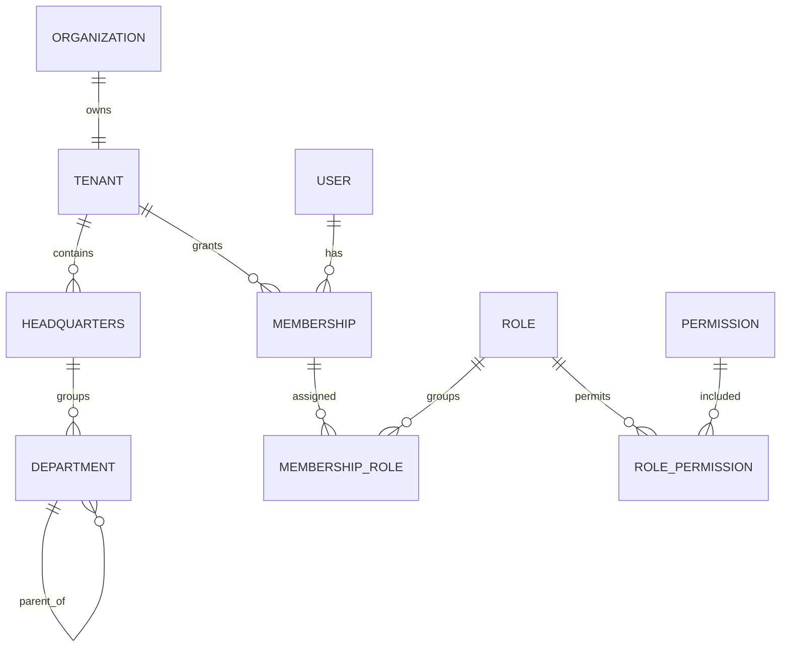
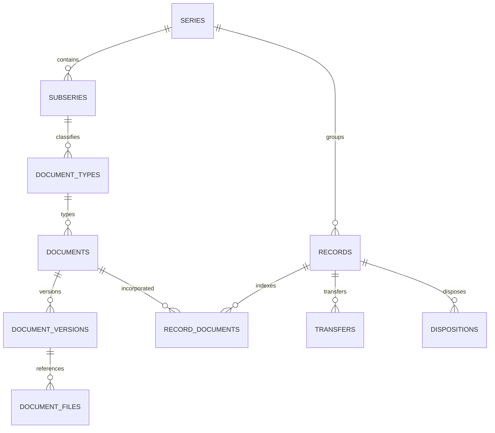
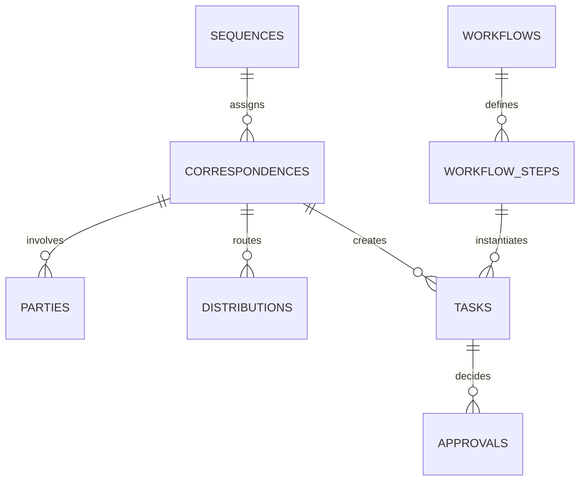
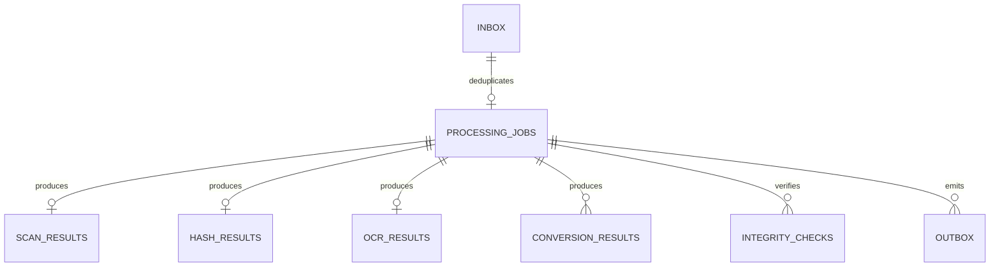
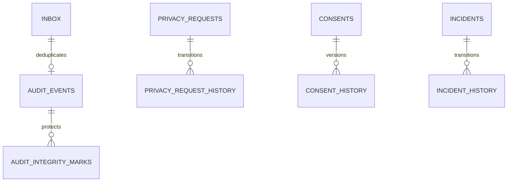
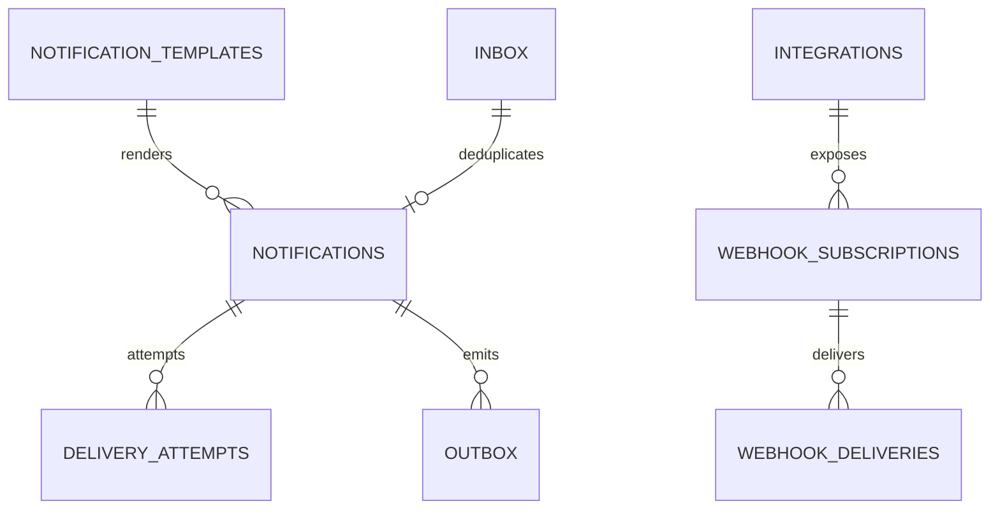

# Diagramas ER por macroservicio

| Campo | Valor |
|---|---|
| Código | GDP-DAT-004 |
| Versión | 0.1 |
| Estado | Borrador lógico, no DDL |
| Fecha | 2026-07-16 |
| Propietario | `[ARQUITECTO_DATOS]` |
| Revisores | `[ARQUITECTO]`, `[RESPONSABLE_SEGURIDAD]`, `[LIDER_ARCHIVISTICO]` |
| Aprobador | `[COMITE_ARQUITECTURA]` |

Las referencias `external_*` no se dibujan como relaciones entre diagramas: son IDs contractuales y no FK cruzadas.

## identity-access-service

## document-core-service

## correspondence-workflow-service

## document-processing-worker

## audit-compliance-service

## notification-integration-service

## Reglas de lectura

- Toda relación dibujada se materializa únicamente dentro de la base del servicio correspondiente.
- La cardinalidad final se valida con casos de negocio antes de DDL.
- `tenant_id`, auditoría técnica y columnas de control se omiten visualmente para legibilidad, pero son obligatorias donde aplique.
- Outbox/inbox se muestran solo donde aclaran el flujo; el patrón aplica a todo servicio productor/consumidor.

## Fuentes, supuestos, decisiones y pendientes

Fuentes: modelos GDP-DAT-001/002, matriz de propiedad y C4 nivel 3. Supuesto: las entidades nombradas cubren el MVP. Decisiones: seis diagramas independientes. Pendientes: atributos físicos, cardinalidades configurables e instrumentos del piloto.

## Historial

| Versión | Fecha | Cambio | Autor |
|---|---|---|---|
| 0.1 | 2026-07-16 | Seis diagramas ER lógicos. | Codex |
