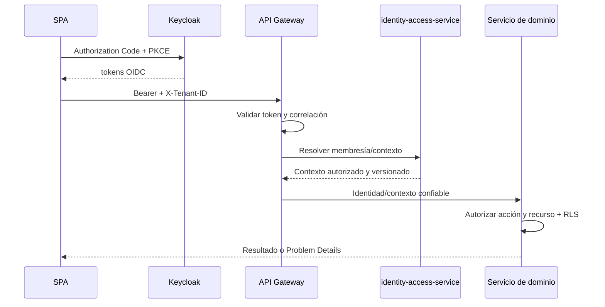

# Autenticación y autorización de API

| Campo | Valor |
|---|---|
| Código | GDP-BE-006 |
| Versión | 0.1 |
| Estado | Borrador para revisión de seguridad |
| Fecha | 2026-07-16 |
| Propietario | `[RESPONSABLE_SEGURIDAD]` |
| Revisores | `[ARQUITECTO]`, `[RESPONSABLE_DATOS]`, `[LIDER_QA]` |
| Aprobador | `[COMITE_SEGURIDAD]` |

## Flujo

La SPA usa Keycloak OIDC Authorization Code con PKCE. No existe endpoint de login propio. Gateway y servicios validan JWT según emisor, audiencia, firma, algoritmo permitido, expiración y not-before; no llaman introspection por cada solicitud salvo diseño posterior. Client Credentials se limita a identidades de carga autorizadas.

## Decisión de autorización

RBAC agrupa permisos y ABAC evalúa tenant, dependencia, recurso, clasificación, estado y delegación. Gateway filtra, pero cada servicio decide. Denegación por defecto. `X-Tenant-ID`, correlation ID, claims de UI o datos del cuerpo no autorizan por sí mismos. Cambio tenant exige membresía activa, nuevo contexto y limpieza de caché frontend.

| Operación vertical | Permiso mínimo | Comprobación de recurso |
|---|---|---|
| Consultar contextos | identidad autenticada | solo membresías propias activas |
| Crear documento/cargar/consultar estado | `document:create` / `document:version` / `document:read` | tenant, tipo, dependencia, estado |
| Radicar entrada | `correspondence:register` o canal público aprobado | tenant, canal, documento autorizado |
| Consultar radicación | `correspondence:read` | tenant, participante/dependencia/rol |

MFA es obligatorio para roles privilegiados según ADR-013. Soporte JIT requiere aprobación, duración, propósito y auditoría. Tokens, códigos, cookies y secretos nunca se registran.

## Errores y ataques

401 incluye desafío genérico; 403 no enumera permisos internos; recursos ajenos pueden responder 404 según política. Se controlan replay, token robado, `kid`/JWKS, confusión de audiencia, algoritmo inseguro, clock skew, elevación por claims y spoofing de headers. Rate limiting no sustituye autorización.

## Fuentes, supuestos, decisiones y pendientes

Fuentes: ADR-013, GDP-REQ-005, THR-001..003/008 y GDP-DAT-015. Supuesto: confianza gateway-servicio estará autenticada por red/identidad de carga. Decisiones: Keycloak autentica; dominio autoriza. Pendientes: realms/clientes, audiences, TTL, rotación, federación, soporte JIT y mTLS interno.

## Historial

| Versión | Fecha | Cambio | Autor |
|---|---|---|---|
| 0.1 | 2026-07-16 | Contrato de autenticación y autorización. | Codex |
